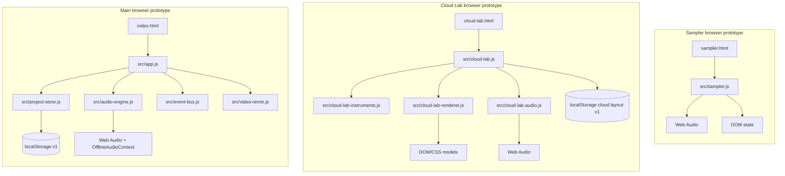
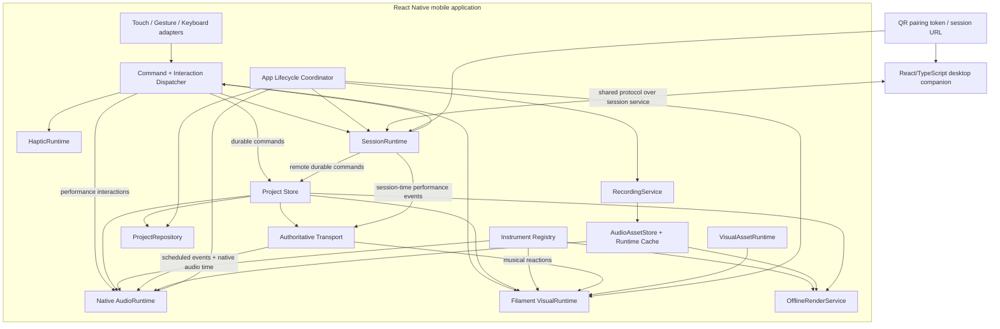

# Pocket Jam Native-First Winter Architecture

Status: authoritative target architecture for September-December 2026  
Snapshot date: 2026-09-09  
Repository scope: current working tree, including the main browser prototype, Cloud Lab, and sampler study  
Implementation status: design only; the native migration described here has not started

This document is the architecture contract for Pocket Jam through the Winter 2026 release. It deliberately separates:

1. the **current web prototype architecture**, which remains useful as tested behavior and migration material;
2. the **target native-first Winter architecture**, which is intended for App Store and Google Play distribution; and
3. the **incremental migration path** between them.

Statements marked **Decision** are binding for Winter work. Statements marked **Starting assumption** require validation but should be followed until evidence changes them. Statements marked **Open decision** must not be silently resolved inside an unrelated implementation task.

## 1. Executive Summary

### Current architecture health

The current repository is a healthy collection of product experiments and an unhealthy production application boundary. It contains three dependency-free browser architecture islands:

- `index.html` with `src/app.js`, `src/audio-engine.js`, and `src/project-store.js` implements a four-track sequencer, live pads, browser persistence, Video Remix, and a small offline WAV render.
- `cloud-lab.html` with `src/cloud-lab.js`, `src/cloud-lab-audio.js`, `src/cloud-lab-instruments.js`, and `src/cloud-lab-renderer.js` implements the strongest object-first interaction experiment and the richest realtime audio runtime.
- `sampler.html` with `src/sampler.js` implements a tactile sampler UI study, but it synthesizes placeholder sounds and its capture control records only a timer/gesture illusion, not microphone audio.

The islands do not share a Project model, Transport, audio-session owner, Instrument Registry, interaction protocol, persistence repository, renderer, or lifecycle policy. This is acceptable for learning, but not for a native product that must add microphone assets, multiplayer, a QR companion, export, and premium 3D within three months.

### Why the browser runtime should not simply become the production app

The browser prototypes prove interaction and scheduling ideas, not the required platform envelope. The shipping product needs native audio-session control, predictable low-latency playback, microphone permissions and recording, durable files, mobile GPU resource ownership, app background/interruption behavior, native builds, signing, and store release configuration. A WebView or one-canvas-per-instrument adaptation would preserve the wrong boundaries and make the most important risks harder to measure.

**Decision:** ship a React Native + Expo + TypeScript mobile application using native development builds and native modules where required. Expo Go compatibility is not a constraint. Use a native-capable audio runtime and a scene-level mobile renderer, with React Native Filament as the preferred 3D direction subject to an early physical-device benchmark gate. Keep a separate React/TypeScript web companion that shares domain and protocol packages, not renderer or platform objects.

### Target architecture health

The target shape is appropriately small for a small team if the boundaries in this document are established early:

- a serializable Project Store is the durable musical and spatial truth;
- an Instrument Registry separates reusable definitions from placed instances;
- normalized commands and performance interactions decouple input from audio, visuals, haptics, persistence, and networking;
- one Transport maps musical time to native audio time;
- one AudioRuntime owns the mobile audio session and realtime graph;
- separate audio and visual asset runtimes own decoded buffers and GPU resources;
- one VisualRuntime owns the scene, renderer, camera, frame loop, and instance handles;
- an explicit OfflineRenderService makes export a capability of every normal audio program;
- SessionRuntime owns multiplayer state, clock synchronization, reconnect, and presence outside Project;
- SQLite-like structured storage and application file storage replace localStorage for production data.

This is a target contract, not implemented health. Today the target architecture is **well specified but unbuilt**.

### Top architectural risks through December

1. **Native audio API capability and maturity.** Exact scheduling, simultaneous synthesis and samples, interruption recovery, recording, and offline rendering must be proven on physical iOS and Android devices before broad instrument work.
2. **Mobile 3D performance and asset discipline.** Twenty detailed, animated objects can fail through materials, transparency, texture memory, draw calls, loading, or thermal throttling even when triangle counts look reasonable.
3. **October schedule concentration.** Microphone sampling, multiplayer testing, QR companion pairing, and the first production 3D slice all depend on September foundations.
4. **Session clock and reconnect quality.** A visually connected multiplayer demo is insufficient if remote notes flam, burst after stalls, duplicate, or lose durable edits.
5. **Realtime/offline audio divergence.** If synths, samples, mixer routing, or effects are implemented only for realtime playback, November export will require a disruptive second audio architecture.

### Migration character

The product application is a new native runtime, so the migration is **rewrite-like at platform edges** and **incremental at domain and behavior seams**. We will not mechanically wrap DOM code, and we will not discard proven behavior. Scheduling rules, procedural synthesis ideas, catalogue metadata, gesture behavior, layout intent, and export parity are ported behind shared contracts. DOM rendering, browser routing, localStorage, isolated sampler state, and Video Remix remain reference or legacy code.

### Gate before aggressive feature expansion

Before adding a large instrument catalogue or polishing many screens, Pocket Jam needs:

- reproducible baseline tests and physical-device measurement harnesses;
- a workspace/monorepo boundary with portable TypeScript packages;
- a signed native development build on one iPhone and one Android device;
- a native AudioRuntime spike proving scheduled playback, live input, sustained voices, interruption recovery, recording, and an export path;
- one authoritative Transport with bounded late-event behavior;
- a versioned Project schema with InstrumentInstances, spatial placement, patterns/loops, mixer state, and asset references;
- one 4x5 interaction/3D benchmark scene;
- a concrete October session protocol and backend decision.

## 2. Confirmed Winter Product Scope

| Capability | Confirmed timing | Architectural consequence |
| --- | --- | --- |
| Native iOS application and Apple App Store distribution | Winter; release preparation by late November/December | Native build, signing, lifecycle, privacy, audio session, schema migration, and crash-reporting seams are required now. |
| Native Android application and Google Play distribution | Winter; release preparation by late November/December | Android audio/recording behavior, permissions, lifecycle, device diversity, and release builds are first-class. |
| Object-first spatial field with at least a 4x5 minimum-phone layout | First production vertical slice in October | Project owns approximately 20 placements; one scene-level renderer observes them. |
| Live performance over already-running loops | Core behavior throughout | Live input takes a direct low-latency path while Transport schedules loops independently. |
| Sequenced patterns and loops | Foundation in September; product expansion in November | Musical content cannot be limited to one 16-step grid or grow into a DAW timeline. |
| Drums, synths, basses, pads, and samples playing simultaneously | Winter | Registry, mixer, polyphony, choke, asset, and export contracts must work across audio programs. |
| Detailed first-party synth editing | November | Parameter schemas and stable audio-program IDs are required; a modular graph is not. |
| Real microphone recording and playable sampling | October | Permissions, recorder, file storage, metadata DB, trimming, decoding, persistence, and optional session transfer are required. |
| Sampler | October/November | The concept migrates to shared Transport, AudioRuntime, Project, Asset, Instrument, and Interaction layers. |
| Audio export | November | Every normal production audio program needs realtime and offline render parity. |
| Detailed tactile 3D instruments and expressive animation | October vertical slice; November expansion | Filament benchmark, visual assets, quality tiers, lifecycle, cache, and disposal are core systems. |
| Visual reactions, glow, particles, and concert-like effects | October/November | Normalized musical/performance events feed a modest visual-reaction layer; effects do not own audio. |
| Haptics | October/November | Independent consumer of normalized interaction events with graceful fallback. |
| Multiplayer test | October | Session identity, actor/device IDs, clock sync, ordering, dedupe, reconnect, and backend seam are September dependencies. |
| QR-paired desktop companion | October | Web companion is a distinct device role using shared protocol/domain packages. QR is discovery only. |
| Durable local projects and user audio assets | October | Structured metadata and binary files have separate storage and migration responsibilities. |
| Instrument, kit, scene, and project-starting presets | Taxonomy in September; product work in November | Preset kinds remain explicit rather than one overloaded `preset` object. |
| Mobile performance, memory, latency, and thermal quality | Continuous; release gate in late November/December | p95/p99 physical-device measurements and a representative 10-minute load are release criteria. |

**Decision:** Video Remix is outside the Winter target. `src/video-remix.js`, its UI in `index.html`, and ADR 0002 remain legacy prototype history. They are not migrated, and their large-video decode/memory concerns do not drive the native roadmap.

## 3. Feature-to-Architecture Coverage Matrix

Status vocabulary:

- **Ready by architecture:** the target contract has an explicit owner and path.
- **Needs extension:** a useful current concept exists but is not sufficient for native production.
- **Needs implementation:** no production subsystem exists in the repository.
- **Open product decision:** implementation depends on a product decision called out in Section 27.

| Feature | Required subsystem | Supported by target architecture? | Missing work | Target timing |
| --- | --- | --- | --- | --- |
| Native iOS app | mobile shell, platform adapters, lifecycle | Ready by architecture | Expo app, native dev build, audio/renderer integration, device QA | September foundation; Winter release |
| Native Android app | mobile shell, platform adapters, lifecycle | Ready by architecture | Same plus Android device matrix and audio-route validation | September foundation; Winter release |
| App Store | release configuration, privacy, migrations | Ready by architecture | identifiers, signing, permission copy, privacy declarations, release build pipeline | Late November/December |
| Google Play | release configuration, permissions, migrations | Ready by architecture | application ID, signing, data-safety inputs, release build pipeline | Late November/December |
| 4x5 spatial field | Project Scene, InteractionRuntime, VisualRuntime | Ready by architecture | minimum-screen layout, picking/hit areas, accessibility, benchmark scene | September/October |
| Live one-shot play | InteractionRuntime, AudioRuntime | Needs extension | port current trigger behavior to native audio and normalized events | September |
| Sustained notes/continuous/XY | InteractionRuntime, AudioRuntime, registry strategies | Needs extension | native multitouch, cancel semantics, smoothing, per-definition mapping | September/October |
| Live play over loops | Transport, AudioRuntime | Needs extension | unify live and scheduled paths; test under load | September |
| Sequenced patterns | Project Pattern, commands, Transport | Needs extension | portable model/editor projection and native scheduling | September/November |
| Flexible loops | Project Loop, Transport | Needs implementation | pattern/audio loop model, lengths, offsets, repeat behavior | September/November |
| Multiple simultaneous instruments | AudioRuntime, mixer, polyphony/choke | Needs extension | production graph, per-instance voices, physical-device stress tests | September/November |
| Drums and basses | Instrument Registry, audio programs | Needs extension | port procedural programs with realtime/offline parity | September/November |
| Parameter-rich synths | registry parameter schema, synth programs | Ready by architecture | first-party implementations, UI, presets, export parity | November |
| Microphone recording | RecordingService, permissions, AudioAssetStore | Needs implementation | native recording spike and production flow | October |
| Trimming/preparation | sample editor, asset metadata | Needs implementation | nondestructive trim UI/data and optional normalized derivative policy | October |
| Playable sampled instrument | sample audio program, decoded-buffer cache | Needs implementation | registry definition, asset binding, choke/polyphony, preload/failure UX | October |
| Sampler surface | shared Project/Asset/Interaction/AudioRuntime | Needs implementation | port behavior; do not port isolated `src/sampler.js` runtime | October/November |
| Audio export | OfflineRenderService, export-capable programs | Needs extension | prove native/offline approach; implement project render and file share | September spike; November product |
| Tactile animated 3D | VisualRuntime, VisualAssetRuntime | Needs implementation | Filament slice, models, animation/reaction handles, quality tiers | October/November |
| Visual reactions/VFX | VisualReactionProfile, VisualRuntime | Needs extension | normalized event mapping and bounded pool | October/November |
| Haptics | HapticRuntime | Needs extension | native haptic adapter and capability fallback | October |
| Pressure/derived velocity | input adapters, interaction strategies | Ready by architecture | device capability detection and mapping tests | October/November |
| Local project persistence | ProjectRepository, schema migrations | Needs implementation | SQLite-like adapter, autosave/recovery, import/export tests | September/October |
| Binary asset persistence | AudioAssetStore, filesystem | Needs implementation | file ownership, cleanup, backup policy, integrity checks | October |
| Presets | PresetCatalog and Project commands | Needs extension | implement explicit types and product UI | November |
| Multiplayer test | SessionRuntime, protocol, relay/service | Needs implementation | backend choice, clock sync, sequencing, reconnect, presence | October |
| Remote performance timing | SessionClock, ClockSync, Transport mapping | Needs implementation | sync estimator, jitter policy, metrics, device tests | October |
| Durable collaborative edits | command authority, snapshots/replay | Needs implementation | MVP authority and conflict policy | October |
| Custom sample in multiplayer | asset availability and transfer seam | Open product decision | decide local-only vs upload/share; backend/object storage if shared | Decision in September; October if in scope |
| QR desktop companion | pairing service, companion web, capabilities | Needs implementation | token flow, QR scan/deep link, web UI, role negotiation | October |
| Companion mixer/sequencer/overview | web app, shared core/protocol | Ready by architecture | choose October surface and implement it | October |
| Mobile performance | benchmark harness and quality policy | Ready by architecture | real assets, physical-device p95/p99/thermal baselines | Start September; continuous |

No confirmed feature is intentionally assigned to the legacy Video Remix path or to a DOM/localStorage production dependency.

## 4. Current Repository Architecture

### 4.1 Current system map



There is no package manifest, lockfile, TypeScript configuration, application framework, native application, shared workspace package, or production test/build pipeline. `.github/workflows/pages.yml` publishes the static files. Existing uncommitted work is part of the audited working tree and must not be casually overwritten during migration.

### 4.2 Useful current findings to preserve

- `src/audio-engine.js` uses a 25 ms JavaScript poll to schedule approximately 100 ms ahead against `AudioContext.currentTime`. The timer wakes the scheduler; it does not define note time. This conceptual model should survive.
- `AudioEngine.setProject()` keeps a cloned scheduling snapshot, avoiding reads from concurrently edited UI state.
- `AudioEngine.renderWav()` reuses the same `connectVoice()` logic in `OfflineAudioContext`. This realtime/offline parity is the seed for the export contract.
- `src/cloud-lab-audio.js` has useful lifecycle behavior: one graph owner, deduplicated resume, explicit event times, global voice limiting, sustained-voice IDs, release/steal cleanup, injectable context/destination, and disposal.
- `src/cloud-lab-instruments.js` is the strongest portable seed. It already separates catalogue metadata and immutable layout replacement from DOM and AudioNodes.
- Cloud Lab uses Pointer Events, pointer capture, independent pointer state, cancellation, keyboard alternatives, and stable visual hit targets.
- The field can mix Cloud, Orbit, and Cyber definitions. World metadata is already classification rather than a one-world compatibility rule.
- Renderer and audio objects have not leaked into saved JSON.

### 4.3 Current limitations relevant to migration

- The main sequencer has the only valid musical look-ahead path. Cloud Lab's 260 ms Drift Loop and the sampler's 420 ms hold loop use `setInterval()` callback time as note time and are prototype-only.
- Main `play()`/`trigger()` do not reliably await/report audio unlock, and late wake-up can schedule a catch-up burst because generation and bounded late-step rules are absent.
- Current sampler pads are procedural oscillator/noise voices. There are no microphone files, AudioAsset records, sample buffers, load cache, waveform data, or playable recorded samples.
- `src/app.js` and `src/cloud-lab.js` coordinate DOM, domain mutation, persistence, audio, timers, visual reactions, and haptics directly.
- Cloud definition fields such as polyphony, choke group, detailed parameter targets, materials, and animation profiles are only partially enforced by runtime code.
- `src/cloud-lab-renderer.js` is a DOM/CSS factory. `SLOT_PRESENTATION`, rather than Project placement, is the actual visual authority. Its module-global GLB adapter is not a production asset or scene architecture.
- There is no backend, session identity, clock synchronization, ordering, reconnect, presence, pairing service, or desktop application.
- `localStorage` stores one main Project v1 and one separate Cloud layout. It is not suitable for microphone binaries or native project persistence.
- Mobile lifecycle handling is partial and inconsistent. Current smoke measurements are browser JavaScript-call measurements, not acoustic latency or mobile thermal validation.

### 4.4 Migration classification

| Current area | Classification | Native migration treatment |
| --- | --- | --- |
| Main look-ahead scheduling rules | Reuse concept / port logic | Reimplement around native audio time, generation, diagnostics, and bounded late policy. |
| Main procedural voices | Reuse concept / port logic | Port selected algorithms into registered audio programs with export parity. |
| `AudioEngine.renderWav()` | Reuse concept | Preserve one-source-of-truth realtime/offline intent; replace browser download plumbing. |
| Cloud audio lifecycle and voice registry | Reuse concept / port logic | Adapt useful ownership/cleanup ideas to the chosen native audio API. |
| Cloud instrument definitions | Reuse and refine | Convert to typed first-party definitions and remove/implement misleading fields. |
| Cloud pointer/gesture behavior | Behavior reference / selective port | Rebuild with Gesture Handler/native input and normalized records. |
| Cloud mixed-world object field | Design and domain reference | Preserve free mixing and object-first behavior in Project/VisualRuntime. |
| DOM/CSS objects and `SLOT_PRESENTATION` | Reference only | Copy placement intent into Project data; do not make DOM or CSS the native renderer. |
| Module-global GLB adapter | Legacy prototype seam | Do not evolve it into production; replace with one scene-level VisualAssetRuntime. |
| Main page routing and narrow-screen redirect | Reference only | Replace with Expo Router and native layouts. |
| `localStorage` adapters | Legacy web only | Keep prototypes runnable; native uses structured storage plus filesystem. |
| Isolated sampler runtime | Behavior/design reference | Rebuild sampler on shared contracts; do not port its timers/global state. |
| Video Remix | Legacy / outside Winter | Preserve files and history only; do not migrate. |

## 5. Native Stack Decision

| Choice | Why it fits Pocket Jam | Main risks and guardrails |
| --- | --- | --- |
| React Native | Shared TypeScript product shell across iOS/Android, native views and modules, mature gesture/navigation ecosystem | React commits can stall; keep audio scheduling and frame ownership outside component renders. Avoid mirroring hot runtime state into React. |
| Expo | Build/update/config tooling and practical native development workflow for a small team | Expo Go cannot host every required native module. Use development builds/prebuild/EAS or equivalent from the beginning; pin and test native versions. |
| TypeScript | Portable domain/protocol packages and validated identifiers/contracts | Types do not validate persisted/network input. Add runtime schema validation at boundaries. |
| Expo Router | Conventional file-based application shell, deep links useful for pairing, and Expo alignment | Musical/runtime ownership must not follow route component lifetimes accidentally. Long-lived runtimes belong above routes. |
| React Native Gesture Handler | Stable native gesture arbitration, multitouch, long press, drag, and cancellation | Gesture callbacks can be high rate. Normalize/coalesce; do not persist or network every sample. |
| Reanimated | Smooth UI-panel and inexpensive native-thread interaction animation | It is not a musical clock and does not own 3D scene animation. Audio time remains authoritative. |
| React Native Audio API | Web-Audio-like conceptual bridge for precise scheduling, synthesis, buffers, effects, and potentially offline graphs | **Mandatory spike:** confirm iOS/Android API coverage, native scheduling accuracy, recording integration, AudioBuffer lifetime, and offline render behavior. If blocked, select an equivalent native runtime behind the same contracts and record an ADR. |
| React Native Filament | Native/mobile-oriented renderer, explicit scene and GPU resource model, suitable for premium object-first 3D | Ecosystem integration, picking, animation, Expo compatibility, asset format, device recovery, and thermal cost need proof. Pass the Section 16 benchmark gate before committing the full art pipeline. |
| React/TypeScript companion web | Fast desktop delivery and browser-appropriate mixer/sequencer/overview surfaces | Do not force Filament/native UI onto web. Share only portable core/protocol/definition data. |

**Starting assumption:** React Native Filament is the production direction. React Three Fiber with Expo GL is a benchmark/fallback candidate, not the default production architecture. A WebView/WebGL-centric shell is rejected unless measured results and required features demonstrate a concrete advantage.

**Decision rule for substitutions:** a replacement for the preferred audio or renderer stack requires a short ADR documenting the hard blocker, physical-device evidence, migration impact, and how all contracts in this document remain satisfied.

## 6. Target Repository / Monorepo Structure

The migration may introduce the structure incrementally; it need not move legacy files on day one.

```text
pocket-jam/
  apps/
    mobile/
      app/                       # Expo Router routes
      src/
        composition/             # runtime wiring, no domain rules
        audio/                   # native AudioRuntime + programs
        visual/                  # Filament VisualRuntime + reactions
        interaction/             # touch/gesture/keyboard adapters
        sampling/                # recorder and sample preparation UI adapters
        persistence/             # SQLite/filesystem adapters
        session/                 # mobile connection/platform adapter
        platform/                # lifecycle, permissions, haptics, sharing
      app.config.ts
    companion-web/
      src/
        session/
        views/
        platform/

  packages/
    core/
      project/                   # schema, migrations, commands, selectors
      transport/                 # musical position and scheduling policy
      music/                     # ticks, notes, pattern/loop calculations
      presets/
    protocol/
      messages/                  # validated wire schemas
      session-clock/             # portable clock estimation math
      capabilities/
    instrument-definitions/
      definitions/               # first-party catalogue data
      schemas/                   # parameters/capabilities
    shared/
      ids/                       # branded/stable ID helpers
      validation/
      diagnostics/

  assets/
    audio/                       # bundled factory audio, not user recordings
    instruments/                 # GLB and quality variants
    textures/
    environments/

  legacy-web/                    # optional later move; current files may stay at root during migration
  docs/
    adr/
```

### Dependency direction

```text
packages/shared
      ↑
packages/core ← packages/instrument-definitions
      ↑                    ↑
packages/protocol ─────────┘
      ↑
apps/mobile        apps/companion-web
```

The exact package arrows may be split to avoid cycles, but these rules are binding:

- portable packages do not import React Native, Expo, Filament, browser DOM, AudioNodes, native file handles, sockets, or UI components;
- `core` owns serializable meaning and deterministic transitions, not side effects;
- `protocol` depends on portable IDs/domain value types, not on either app;
- instrument definitions reference `audioProgramId`, `visualProgramId`, and `interactionStrategyId`; executable native/browser programs live in app adapters;
- mobile and companion runtimes may interpret the same Project and protocol differently;
- legacy browser modules do not become shared packages merely by being copied. Code must first be made platform-neutral and characterized.

## 7. Target System Map



The dispatcher is not a global everything-bus. Durable Project changes use deterministic commands and revision notifications. High-rate performance interactions use a bounded realtime path. Consumers subscribe only to event families they own.

## 8. Domain / Project Data Model

### 8.1 Project truth

The following is a conceptual TypeScript shape, not a requirement to name every field exactly this way:

```ts
type Project = {
  schemaVersion: number;
  id: ProjectId;
  revision: number;
  name: string;
  createdAt: IsoDate;
  updatedAt: IsoDate;
  transport: TransportConfig;
  scene: Scene;
  instruments: Record<InstrumentInstanceId, InstrumentInstance>;
  patterns: Record<PatternId, Pattern>;
  loops: Record<LoopId, MusicalLoop>;
  mixer: MixerState;
  assetRefs: Record<AssetId, AssetReference>;
  presetRefs?: PresetReference[];
};

type TransportConfig = {
  bpm: number;
  timeSignature: { numerator: number; denominator: number };
  swing: number;
  swingSubdivision: "1/8" | "1/16";
  loopRange?: { startTick: number; endTick: number };
};

type Scene = {
  placements: Array<{
    instanceId: InstrumentInstanceId;
    cell: { column: number; row: number };
    footprint: { columns: number; rows: number };
    transform?: {
      offsetX: number; offsetY: number; elevation: number;
      yaw: number; scale: number;
    };
  }>;
  visualEnvironmentId?: string;
};

type InstrumentInstance = {
  id: InstrumentInstanceId;
  definitionId: InstrumentDefinitionId;
  parameters: Record<ParameterId, JsonScalar>;
  audioAssetBindings?: Record<string, AssetId>;
  mixerChannelId: MixerChannelId;
};

type Pattern = {
  id: PatternId;
  name: string;
  lengthTicks: number;
  resolution: number;
  lanes: Array<{
    targetInstanceId: InstrumentInstanceId;
    events: Array<PatternEvent>;
  }>;
};

type PatternEvent = {
  id: EventId;
  tick: number;
  kind: "trigger" | "note";
  velocity: number;
  note?: number;
  durationTicks?: number;
  parameterLocks?: Record<ParameterId, number>;
};

type MusicalLoop = {
  id: LoopId;
  enabled: boolean;
  source:
    | { kind: "pattern"; patternId: PatternId }
    | { kind: "audio"; assetId: AssetId; targetChannelId: MixerChannelId };
  startTick: number;
  lengthTicks: number;
  sourceOffsetTicks?: number;
  repeat: boolean;
};

type MixerState = {
  master: { gain: number; effectChainPresetId?: string };
  channels: Record<MixerChannelId, {
    gain: number;
    pan: number;
    mute: boolean;
    solo: boolean;
    sends: Record<EffectBusId, number>;
  }>;
  buses: Record<EffectBusId, { effectProgramId: string; parameters: Record<string, number> }>;
};

type AssetReference = {
  assetId: AssetId;
  expectedKind: "audio" | "visual";
};
```

### 8.2 Model constraints

- Project is JSON-serializable and schema-validated after database, file import, network, or deep-link boundaries.
- `revision` increments for accepted durable mutations. It supports persistence, UI subscriptions, command conflict checks, and diagnostics; it is not a network consensus algorithm.
- Stable IDs address instruments, patterns, loops, channels, events, and assets. Scene array order is not identity.
- Scene placement is authoritative. Visual mesh transforms are derived views and never write themselves back implicitly.
- The minimum supported scene accommodates a 4x5 logical field. Larger footprints reserve multiple cells. Product UI may art-direct offsets without losing logical placement.
- `worldId`, `collectionId`, and `styleId` belong on definitions or visual metadata. They do not prevent different visual worlds from coexisting.
- Project stores asset IDs, not file URIs as portable identity. A local asset repository resolves the current device's file location.
- Defaults may resolve from InstrumentDefinition. Persist instance overrides needed to reproduce the sound; migrations materialize values when definition changes would otherwise alter old projects.

### 8.3 Runtime-only data

The following never enters Project JSON:

- AudioContext/native engine handles, AudioNodes, decoded buffers, active voices, scheduled callback handles, or local audio time;
- Filament engine/view/scene/entity/material/texture/animation handles, hit-test objects, frame timestamps, or pooled particles;
- React components, refs, gesture objects, animated shared values, pointer captures, or navigation state;
- native file handles, temporary recording files, database connections, open streams, or permission objects;
- sockets, connection state, participant presence, ping samples, session keys, jitter buffers, or clock estimates;
- current playback cursor and transient pressed/hovered/selected visual state unless a product requirement explicitly makes it durable.

## 9. Instrument Architecture

### 9.1 Definition versus instance

An `InstrumentDefinition` is reusable first-party catalogue capability. An `InstrumentInstance` is one placed, parameterized, mixed object in one Project. Two Cloud Kicks share one definition but have independent IDs, positions, parameters, patterns, voices, mixer channels, and visual handles.

```ts
type InstrumentDefinition = {
  id: InstrumentDefinitionId;
  version: number;
  name: string;
  category: "drum" | "synth" | "bass" | "pad" | "sample" | "effect-control";
  collectionId?: string;
  worldId?: string;
  styleId?: string;
  footprint: { columns: number; rows: number };
  audioProgramId: AudioProgramId;
  visualProgramId: VisualProgramId;
  interactionStrategyId: InteractionStrategyId;
  parameterSchema: ParameterDefinition[];
  defaultParameters: Record<ParameterId, JsonScalar>;
  polyphony: { maxVoices: number; stealing: "oldest" | "released-first" | "quietest" };
  chokeGroupId?: string;
  visualAssetIds: AssetId[];
  factoryAudioAssetIds?: AssetId[];
  interactionCapabilities: Array<"trigger" | "note" | "continuous-x" | "continuous-y" | "pressure">;
  exportSupport: "required" | "unsupported-with-justification";
};
```

`src/cloud-lab-instruments.js` is the migration seed, not the final schema. Its eight definitions, footprints, mixed worlds, parameter descriptions, render descriptors, and immutable lookup helpers should be characterized and converted. Fields that claim behavior must have a validating consumer.

### 9.2 Program registries

The mobile composition root maintains small explicit registries:

```text
audioProgramId            -> native realtime + offline audio program
visualProgramId           -> Filament view factory/reaction adapter
interactionStrategyId     -> normalized interaction-to-parameter mapping
```

New first-party instruments register programs and data. They must not add another branch to a single central switch spread across input, renderer, audio, and export. This is an internal registry for approximately 10-30+ first-party definitions, not a public plugin ABI or arbitrary DSP graph.

### 9.3 Synth and sample-backed instances

- Synth definitions expose bounded, typed parameters such as oscillator wave, filter cutoff/resonance, ADSR, pitch, drive, effect sends, and instrument-specific values.
- Runtime programs smooth continuous numeric parameters and validate enum changes. UI controls are generated or configured from schema but may still be art-directed.
- A `SampleInstrument` is a normal definition whose instance binds a stable `assetId` to a declared slot such as `primarySample`. Trim points belong to AudioAsset metadata or a project-specific playback region, not to decoded buffers.
- Choke and polyphony policies are definition data enforced by AudioRuntime and OfflineRenderService.
- Visual style never determines audio compatibility. A cyberpunk visual can use the same interaction/audio archetype as a Cloud object without sharing renderer technology.

### 9.4 Command / Interaction Layer

#### Durable project commands

Durable commands produce deterministic Project transitions and revision increments. Examples:

```text
instrument.add
instrument.move
instrument.remove
instrument.parameter.set
instrument.asset.bind
mixer.gain.set
mixer.pan.set
mixer.mute.set
transport.bpm.set
transport.loopRange.set
pattern.event.upsert
pattern.event.remove
loop.upsert
loop.remove
```

The minimum local envelope is deliberately small:

```ts
type ProjectCommand = {
  type: string;
  commandId: CommandId;
  projectId: ProjectId;
  baseRevision?: number;
  actorId?: ActorId;       // added when a session is active
  issuedAt?: IsoDate;      // diagnostic, not the musical clock
  payload: unknown;
};
```

September code does not need fake server sequence numbers or complete December session metadata. SessionRuntime enriches/encapsulates the portable command for network transport.

#### Ephemeral performance interactions

```ts
type PerformanceInteraction = {
  interactionId: InteractionId;
  phase: "trigger" | "start" | "update" | "stop" | "cancel";
  targetInstanceId: InstrumentInstanceId;
  source: "touch" | "keyboard" | "sequencer" | "companion" | "remote";
  localMonotonicTime: number;
  musicalTime?: MusicalTime;
  sessionTime?: SessionTime;
  note?: number;
  x?: number;
  y?: number;
  pressure?: number;
  derivedVelocity?: number;
  movement?: { dx: number; dy: number; speed: number };
  pointerType?: "touch" | "pen" | "mouse" | "keyboard" | "synthetic";
};
```

Live input fans out immediately to local AudioRuntime, VisualRuntime, and optional HapticRuntime. It does not wait for React state, persistence, server acknowledgement, or remote peers. If connected, SessionRuntime receives a copy after the local low-latency path.

High-rate updates are ephemeral. Audio may consume native-rate/smoothed values; visuals normally consume the latest value once per frame; networking throttles/coalesces and receivers interpolate; persistence commits intentional final parameter values at a controlled interval or gesture end. Start/stop/cancel boundaries are never dropped.

## 10. Transport / Musical Time

Pocket Jam has one authoritative musical Transport per active Project playback session.

### Responsibilities

- BPM, time signature, bar/beat/subdivision/tick conversion;
- swing applied to defined subdivisions;
- loop range, musical position, generation, start/pause/resume/stop;
- iteration over enabled Pattern and audio loops;
- look-ahead horizon and scheduling diagnostics;
- bounded late-event policy;
- mapping between session musical time and local native audio time;
- notifying UI/visual consumers without letting them control timing.

### Clock rules

The native audio engine's monotonic render/scheduling time is the local authority for note start. JavaScript timers may wake a look-ahead scheduler, request more work, update UI, debounce persistence, measure pings, and time nonmusical affordances. They must never decide that a note is due "now" merely because a callback fired.

The Transport produces scheduled events with a musical timestamp, playback generation, and exact local audio time. AudioRuntime submits those events to native scheduling. UI playheads derive their position from a Transport snapshot and tolerate dropped frames.

### Live and sequenced coexistence

- Sequenced Pattern/Loop events enter AudioRuntime through the scheduled path.
- Local live input enters immediately or with the smallest safe native lead and uses the same instrument audio program, mixer channel, voice/choke policy, and reaction event family.
- Starting a live note does not pause, quantize, or restart the Transport unless an explicit instrument mode requests quantization.
- Editing a future pattern replaces the Project snapshot/revision used for unscheduled horizons. Already committed native events obey a documented cancellation/generation policy.

### Late-step policy

Exact thresholds are calibrated in the audio spike, but behavior is fixed conceptually:

1. Slightly late scheduled events within a small tolerance are clamped to the earliest safe native time and counted.
2. Events beyond the tolerance are skipped or the Transport resynchronizes to the current musical position; it never emits an unbounded catch-up burst.
3. Live local input is played immediately and is not discarded for missing a grid line.
4. Remote ephemeral events use their session timestamp and a small adaptive lead/jitter window. Events too late for a musically useful schedule follow instrument-aware play-now/drop rules and are counted.
5. Every start/resume/seek increments a generation so stale scheduled UI and runtime work can be ignored.

### Session mapping seam

```text
session monotonic time
  -> SessionClock offset/drift estimate
  -> local monotonic time
  -> calibrated local native-audio-time mapping
  -> exact AudioRuntime schedule time
```

The session service does not distribute AudioContext seconds. Each device owns a different audio clock. Transport exposes the conversion seam; SessionRuntime owns network clock estimates.

## 11. Pattern / Loop Architecture

Pocket Jam is a live instrument field with loops and sequencing, not only a 16-step groovebox and not a DAW.

### Smallest Winter model

- A `Pattern` is editable musical event content with an explicit tick length and one or more lanes targeting stable InstrumentInstance IDs.
- A step sequencer is one editor/projection of a Pattern whose events align to a selected grid. Sixteen steps are a UI choice, not a schema invariant.
- A `MusicalLoop` places and repeats either Pattern content or an audio asset on the Transport timeline. It declares length and offset explicitly.
- Different loop lengths are allowed. Transport repeats each loop against its own length while respecting the Project loop range.
- Mute/solo belongs to mixer/channel state; disabling a specific musical loop belongs to the Loop.
- Live interaction is not automatically recorded into a clip. Microphone recording creates an AudioAsset, not a performance-event clip.

Winter does not require freeform arrangement regions, arbitrary automation curves, comping, time stretching, clip warping, or a song-length multitrack editor. Parameter locks on discrete Pattern events are sufficient only where a real instrument/editor needs them. If live-performance recording becomes a product requirement, add it through a separate decision rather than smuggling a `PerformanceClip` into the foundation.

## 12. Native Audio Architecture

### 12.1 Ownership

One application-level `AudioRuntime` owns:

- native audio context/engine creation and activation;
- iOS audio-session and Android audio-focus/category configuration;
- output route state and the master graph;
- per-instance/channel mixer nodes and shared effect buses;
- AudioProgram instances and active voice registry;
- exact-time scheduled events from Transport;
- immediate local live events;
- polyphony, choke, release, stealing, and cleanup;
- sample decode/preload/cache integration;
- interruption, route-change, foreground/background, and disposal behavior;
- audio diagnostics such as scheduling lateness, voice counts, underruns where exposed, and graph setup time.

It is created above route screens and injected into controllers. React components select serializable status snapshots and issue intents; they do not own the native engine or voice nodes.

### 12.2 Graph shape

```text
AudioProgram voice/sample source
  -> per-voice envelope/filter
  -> InstrumentInstance channel (gain, pan, mute/solo)
  -> dry master and optional shared sends
  -> shared first-party effect buses
  -> master processing/limiter
  -> platform output
```

The Project stores graph intent: parameter values, channel gain/pan/mute/solo, sends, bus program IDs, and effect parameters. AudioRuntime stores native graph handles, smoothed automation, active voices, decoded buffers, meters, and current route.

### 12.3 AudioProgram contract

Each registered production audio program has one musical definition and two execution paths:

```ts
interface RealtimeAudioProgram {
  prepare(instance, assets, runtime): Promise<void>;
  handle(interaction, audioTime, runtime): void;
  schedule(event, audioTime, runtime): void;
  applyParameters(changes, audioTime, runtime): void;
  releaseAll(audioTime, reason): void;
  dispose(): void;
}

interface OfflineAudioProgram {
  prepare(instance, assets, offlineRuntime): Promise<void>;
  schedule(event, audioTime, offlineRuntime): void;
  finalize?(): Promise<void>;
}
```

The exact interface may vary with the native audio API. The binding rule does not: definition IDs resolve to tested program factories, and normal programs must produce the same musical result in realtime and export. Shared declarative voice-building helpers are preferable where the API supports both realtime and offline graphs. A program that cannot export must declare it, explain the product reason, and receive explicit review.

### 12.4 Voices and parameters

- Active voices are keyed by runtime voice ID and associated with InstrumentInstance ID, note/interaction ID, start time, and choke group.
- Sustained notes have explicit start/update/stop/cancel semantics. Lifecycle interruption calls `releaseAll` deterministically.
- Polyphony is enforced per definition/instance plus a safe global ceiling. The stealing rule is deterministic and mirrored by export when audible.
- Continuous parameter changes use native automation/smoothing and bounded update rates. React state changes are not required per move.
- Bundled factory samples can be preloaded by scene. User samples load through AudioAssetRuntime with explicit loading/error states and memory limits.

### 12.5 Native audio decision gate

Before accepting the default audio stack, the spike must prove on a recent iPhone, an older/mid-tier iPhone, and a mid-tier Android:

1. cold and warm unlock/activation;
2. exact scheduling of at least two minutes of loop events while UI/3D is busy;
3. one-shots plus several sustained/continuous voices during Transport playback;
4. route changes, phone/Siri/other-audio interruption, background/foreground, and recovery;
5. microphone record while the runtime is configured for playback/monitoring as product policy permits;
6. sample file decode and repeated low-latency triggering;
7. an offline or deterministic non-realtime render path using the same audio-program definitions;
8. stable cleanup across scene/project swaps.

If React Native Audio API fails a hard requirement, keep the public contracts and evaluate the smallest native alternative. Do not spread vendor-specific objects into core packages while deciding.

## 13. Microphone Sampling Architecture

### 13.1 End-to-end flow

```text
user requests recording
  -> permission rationale + OS microphone permission
  -> RecordingService configures audio session and creates a temporary file
  -> native recorder writes encoded/PCM audio
  -> stop/cancel/interruption finalizes or deletes temporary data
  -> AudioAssetStore validates duration/format and atomically registers metadata + durable file
  -> waveform/peak analysis is generated asynchronously if useful
  -> user sets nondestructive trim/start/end and preview options
  -> Project command creates or updates a SampleInstrument binding to assetId
  -> AudioAssetRuntime decodes/preloads the trimmed source
  -> sample plays through normal AudioRuntime/mixer while loops continue
  -> Project and asset metadata persist independently
  -> SessionRuntime advertises availability or requests share/upload when multiplayer policy allows
```

### 13.2 AudioAsset metadata

```ts
type AudioAsset = {
  assetId: AssetId;
  kind: "user-recording" | "factory-sample" | "imported-audio" | "rendered-export";
  storageKey: string;              // repository-local key, not public identity
  mimeType: string;
  codec?: string;
  sampleRate?: number;
  channelCount?: number;
  durationSeconds: number;
  createdAt: IsoDate;
  byteLength: number;
  contentHash?: string;
  trim: { startSeconds: number; endSeconds: number; fadeInMs?: number; fadeOutMs?: number };
  analysis?: { waveformKey?: string; peak?: number; normalizedGain?: number };
  syncState?: "local-only" | "uploading" | "shared" | "missing";
};
```

The DB record contains metadata. The recording file and optional waveform sidecar live in application file storage. Decoded PCM/AudioBuffers are runtime cache entries only. Project stores an `assetId` binding; it does not embed this metadata wholesale, a filesystem path, base64 audio, WAV bytes, or a decoded buffer.

### 13.3 Trim and preparation policy

Winter trimming is nondestructive by default: metadata points at start/end and optional short fades. A derived normalized/cropped file may be generated if native playback/export performance requires it, but it receives explicit provenance and atomic lifecycle management. The original must not be deleted while another project/reference needs it.

### 13.4 Recording lifecycle and failure behavior

- Permission denial leaves the rest of the instrument usable and explains how to retry through system settings.
- Recording begins only after the audio session is in a compatible state; the UI must not show recording before native confirmation.
- A maximum duration and free-space check prevent runaway files.
- Backgrounding, calls, route changes, app termination, or recorder errors finalize a recoverable draft when safe, otherwise remove the temp file.
- On launch, a recovery job reconciles orphan temp files and DB rows without deleting referenced assets.
- The default avoids live microphone monitoring to prevent feedback unless the product explicitly designs and tests it.

### 13.5 Multiplayer availability seam

A sample used locally can always remain local-only. A remote peer receiving an event for an unavailable asset gets a deterministic missing-asset state and does not crash or substitute an unrelated buffer. If October requires shared custom samples, the session service needs authenticated upload/download plus object storage, content metadata/hash, size/format limits, progress, cancellation, and retention rules. This is an explicit September scope decision, not an assumption that WebSocket messages carry audio files.

## 14. Asset Architecture

### 14.1 Asset domains

Avoid a single vague `GenericAssetManager`. Audio and visual assets have different decode, cache, lifecycle, and performance requirements.

| Layer | Owns | Does not own |
| --- | --- | --- |
| Asset catalogue | stable IDs, bundled manifest, variants, content version/hash | decoded buffers, GPU resources, user-specific local paths |
| AudioAssetStore | user/factory audio metadata, local storage key resolution, file import/copy/delete/reference checks | active AudioBuffers/voices |
| AudioAssetRuntime | context-compatible decode, preload, LRU/ref counts, failures, memory diagnostics | Project identity or durable metadata truth |
| VisualAssetRuntime | GLB/texture/environment load, quality variant selection, GPU upload, clone/instance policy, ref counts, disposal | Project placement or interaction state |
| Project | stable asset references/bindings | binary data, file handles, decoded/GPU objects |

### 14.2 File and ID rules

- Bundled assets are immutable/versioned catalogue entries. User assets are copied into app-controlled storage before becoming durable.
- `assetId` is stable across local file relocation. `storageKey` resolves through the repository adapter.
- Content hashes assist integrity/dedupe/session availability but are not required to expose user content publicly.
- Delete is reference-aware and normally two phase: mark/unlink, then garbage-collect only when no Project, preset, draft, or upload owns the asset.
- Asset writes use a temporary path followed by validation and atomic move/registration where platform facilities allow.
- Cache pressure evicts decoded/GPU representations, never the durable source file.

### 14.3 Visual asset policy

GLB is the preferred model container. The pipeline supports texture/material naming conventions, animations/morph targets, optional compressed geometry, compressed texture variants, environment maps, and low/medium/high quality variants. The first approved production models define the smallest real pipeline; do not build speculative conversion infrastructure for assets that do not exist.

## 15. Native 3D / Visual Architecture

### 15.1 One scene-level runtime

One `VisualRuntime` owns one mobile renderer/view, engine, scene, camera, lighting rig, frame loop, quality controller, VisualAssetRuntime, picking service, reaction pool, lifecycle state, and teardown path.

```ts
interface VisualRuntime {
  mount(surface): Promise<void>;
  syncScene(scene: Scene, instruments: ReadonlyMap<InstrumentInstanceId, InstrumentInstance>): void;
  hitTest(point): HitResult | null;
  handleInteraction(event: PerformanceInteraction): void;
  handleMusicalEvent(event: ScheduledMusicalEvent): void;
  setLifecycle(state): void;
  setQuality(tier): void;
  diagnostics(): VisualDiagnostics;
  dispose(): Promise<void>;
}
```

InstrumentInstance ID maps to a runtime visual handle:

```text
instanceId -> entity/model handles + animation handles + hit proxy + reaction state
```

The handle can update parameters, transform, and reactions and can dispose its owned references. An instrument never creates a renderer or independent animation-frame loop.

### 15.2 Project-driven placement and input

Project Scene owns logical cells, footprints, and optional art-directed offsets. VisualRuntime resolves these to world transforms for the current screen/camera. `SLOT_PRESENTATION` from the prototype is migration reference only; its pleasing layout should be copied into initial Project placement/offset values, not retained as hidden renderer truth.

The 3D surface provides scene picking against simple hit proxies or a mapped interaction plane. Gesture Handler owns gesture recognition/cancellation, then associates normalized input with the picked InstrumentInstance. Complex animated meshes are not required to be hit geometry. Accessible/native alternatives expose stable labels and controls without requiring the mesh to be a React view.

### 15.3 Animation and visual reactions

Definitions may reference a modest `VisualReactionProfile` mapping normalized events to named reactions:

```text
trigger -> squash + emissive pulse + pooled burst
note.start/update/stop -> key depression / transform / material response
control.update -> morph/material/rotation target
transport beat/bar -> optional bounded scene pulse
```

Audio is never triggered by an animation callback. Both audio and visuals consume the same normalized musical/performance event with their own clocks. VisualRuntime interpolates late or coalesced values and may drop purely decorative reactions under load.

Prefer transform springs, scale/squash/stretch, rotations, morph targets, short baked clips, and material parameter changes. Use skeletal animation sparingly. Soft-body simulation, broad physics, large rigs, and per-object procedural simulation require measured product justification.

### 15.4 Lifecycle and recovery

On background, stop the render loop, release transient effects, and obey platform surface rules. On foreground, restore/synchronize the scene from Project, verify resources, and recreate device/context state if the renderer requires it. All entity, material instance, texture, animation, buffer, and environment resources have explicit owner/ref-count/disposal semantics.

## 16. Mobile 3D Optimization Strategy

Premium quality is the combined result of silhouette, art direction, material response, animation, lighting, sound synchronization, and stable frame delivery. Polygon count alone is not a quality metric.

### 16.1 Practical policies

- Reuse geometry and materials when instances genuinely share them; use instancing for repeated objects that keep compatible material/animation needs.
- Keep material/submesh variants intentional and track them as a first-class benchmark budget because they often multiply draw calls. Start with a small reused material family for the 6-8 benchmark models, then set a numeric tier budget from measured assets rather than an arbitrary catalogue-wide law. Atlas or share textures where it improves batching without damaging iteration or memory.
- Use LOD or quality variants for genuinely expensive/large models; tiny distant details should be normal-map/baked detail rather than geometry.
- Bake ambient occlusion and static detail. Prefer a small static/image-based environment and limited dynamic lights.
- Default to compressed textures supported by the renderer/device path, include mipmaps, and choose texture resolution by projected screen size.
- Default common objects to 1K-or-smaller maps. Reserve 2K for measured hero need; avoid 4K mobile assets in the primary field without exceptional evidence.
- Avoid unnecessary alpha blending, layered transparency, large fullscreen glow, and particle overdraw. Prefer opaque/masked surfaces where possible.
- Use one conservative realtime shadow strategy: a small number of important casters/receivers, blob/contact shadows, or baked alternatives. Twenty fully dynamic shadowed objects are not the baseline.
- Keep post-processing limited and quality-tiered. Bloom/glow should be bounded by render resolution and may turn off independently.
- Pool particles and short-lived reaction entities. No per-frame allocation in interaction or render hot paths.
- Preload the current scene's essential assets, progressively load nonessential detail, and expose placeholder/error states. Do not block playable audio on decorative assets.
- Reference-count/cache GPU assets and prove memory returns after repeated Project/scene changes.
- Use visibility/frustum culling even in a mostly fixed field, and stop idle work when offscreen/backgrounded.
- Use bounded adaptive render resolution and adapt render scale/effects/particles/shadows before degrading audio or input. Quality changes should avoid oscillation and be diagnosable.
- Monitor sustained frame time and thermal behavior. A ten-minute jam is more representative than a cold launch screenshot.

### 16.2 Tentative starting budgets

These are experiment inputs, not permanent laws:

| Measure | Initial target for benchmark scene |
| --- | --- |
| Frame delivery | 60 fps target; p95 <= 16.7 ms, p99 <= 33 ms after warm-up; measured stable 30 fps fallback where necessary |
| Draw calls | approximately 100 baseline / 150 peak |
| Visible geometry | approximately 200k-300k triangles for the initial full field |
| GPU texture memory | approximately 64-128 MiB estimate for scene assets, calibrated per tier |
| Dynamic lights | one primary plus minimal accents; avoid per-object shadowed lights |
| Fullscreen post effects | zero or one bounded pass at default tier |
| Interaction main-thread tasks | no recurring >50 ms task; p95/p99 tracked |
| Scene swap stability | no monotonic GPU/heap growth after 100 swaps/replacements |

If a beautiful representative scene exceeds one starting number while meeting frame, memory, thermal, and latency targets, change the budget. If it meets a triangle target but misses frame time, optimize the actual bottleneck.

### 16.3 Mandatory renderer benchmark gate

Benchmark before committing all production art:

- 4x5 field with approximately 20 visible object positions;
- 6-8 unique instrument models reused across instances where realistic;
- representative PBR materials, normal maps, baked AO, mipmaps, and compressed texture candidates;
- representative transform/morph/baked animations;
- expected glow/effect load and particles only if planned for the product;
- a live audio loop, several sustained voices, rapid multitouch, and parameter changes;
- asset cold load, warm load, project swap, background/foreground, and ten-minute continuous use.

Test React Native Filament first and compare React Three Fiber/Expo GL only enough to answer concrete risk questions. Test a recent iPhone, older/mid-tier iPhone, and mid-tier Android. Record frame p50/p95/p99, input-to-visual latency, input-to-audio scheduling latency, JS/UI thread stalls, CPU/GPU/heap estimates where available, draw/material/texture/entity counts, cold/warm load time, battery/CPU indicators, and thermal degradation. Store the result as an ADR and reproducible benchmark, not a verbal impression.

## 17. Interaction Architecture

### 17.1 Input adapters

- Gesture Handler translates touch, long press, drag, note-surface movement, and XY input.
- Native keyboard input supports companion/accessibility/testing where relevant.
- Sequencer and SessionRuntime produce the same normalized performance semantics without constructing touch events.
- Visual picking returns an InstrumentInstance ID; the input adapter never exposes a Filament entity to audio or domain code.

### 17.2 Multitouch and cancellation

Each active contact has an interaction ID and independent target/strategy state. A second finger cannot overwrite a single module-global loop or voice. Pointer/gesture cancel, route/navigation transition, application blur/background, lost native surface, instrument removal, and connection role change all lead to an idempotent `cancel`/`stop` and release of audio/visual/haptic state.

### 17.3 Pressure and velocity

Pressure is optional. Records can carry real pressure, touch-major/tool metadata where available, and derived velocity from initial movement/timing. Each interaction strategy chooses fallbacks. No definition may assume pressure exists on every iPhone or Android device. Derived velocity must be bounded and stable enough that the same gesture does not create arbitrary loudness spikes.

### 17.4 Latency path

```text
native gesture/input callback
  -> identify stable instance + strategy
  -> create normalized interaction
  -> local AudioRuntime immediately
  -> independent VisualRuntime/HapticRuntime
  -> optional coalesced SessionRuntime copy
  -> controlled durable parameter command when required
```

Geometry reads, React rerenders, network sends, SQLite writes, and complex visual allocation are excluded from the audio-critical prefix.

## 18. Persistence Architecture

### 18.1 Storage split

| Data | Target store | Notes |
| --- | --- | --- |
| Projects, revisions, preset references | SQLite or equivalent transactional structured store | JSON document rows are acceptable initially if indexed metadata and migrations remain explicit. |
| AudioAsset metadata and references | structured store | Separate from Project and binary bytes. |
| User recording/import binaries | application filesystem | Never giant JSON or DB blobs. |
| Optional waveform/derived sample files | application filesystem | Rebuildable/provenance tracked. |
| Bundled catalogue manifests | application bundle/package | Versioned and read-only. |
| Decoded audio and GPU objects | runtime memory caches | Recreated, never persisted. |
| Session/pairing secrets | secure platform storage where persistence is necessary | Never Project JSON. |

Likely Expo adapters include a SQLite-capable module and application filesystem module, but this document does not add dependencies. The selected libraries must be proven in native development builds.

### 18.2 Repository contract

`ProjectRepository` loads, validates, migrates, saves, lists, duplicates, deletes, and exports/imports project documents. UI and core commands do not call SQLite directly. Autosave listens to accepted Project revisions, batches safely, reports failure, and provides an explicit flush for lifecycle transitions.

### 18.3 Schema and migration

- Persist `schemaVersion` independently from app version.
- Migrations are ordered, pure where possible, backed by fixtures, and never depend on native runtime objects.
- Before destructive migration, retain a recoverable backup/snapshot within a bounded policy.
- Migration failure preserves the source record and surfaces recovery/export options rather than silently starting a blank project.
- Catalogue/InstrumentDefinition version changes are handled separately from Project schema changes.
- Existing localStorage data may be imported through a one-time development/legacy path if product value justifies it; it is not the ongoing production store.

### 18.4 Consistency and recovery

Project save and asset registration cannot always be one filesystem/DB transaction, so use staged state: write temp file, validate, move/register metadata, then commit Project binding. Startup reconciliation removes abandoned temp files after a grace period, marks missing referenced assets, and never deletes an unknown file merely because one query failed. Crash/relaunch restores the last committed Project and reports unsaved/recovered drafts when available.

### 18.5 Backup/open questions

Local-first does not automatically mean device backup, cloud sync, or account sync. Whether multiple projects, OS backup inclusion, file export/import, and cloud backup are required for first public release remains a product decision. The repository API leaves room for them without adding a speculative cloud layer now.

## 19. Preset Architecture

Keep preset kinds explicit:

| Kind | Contains | Applying it changes |
| --- | --- | --- |
| `InstrumentPreset` | definition ID/version compatibility plus parameter values and optional asset-slot expectations | one InstrumentInstance's parameters; never its identity silently |
| `KitPreset` | a selection/configuration of several instrument definitions, parameters, and optional mixer defaults | a chosen group or creates multiple instances |
| `ScenePreset` | placements, footprints, visual environment, optional visual variants | spatial/visual scene; may preserve existing instruments where defined |
| `ProjectTemplate` | complete starter Project data including transport, scene, instruments, patterns/loops, mixer, and asset refs | creates a new Project, not mutates an existing one ambiguously |

Winter need not ship full editors/libraries for all four. The taxonomy prevents today's `presetId` from becoming an object that unpredictably changes tempo, sounds, pattern, mixer, and layout. Presets are validated versioned data applied through explicit Project commands. User audio presets reference assets and obey the same ownership rules.

## 20. Export / Offline Rendering

### 20.1 Contract

```text
validated Project snapshot at revision N
  + InstrumentDefinitions/program versions
  + resolved AudioAssets
  + Transport/Pattern/Loop expansion over requested range
  + Mixer/effect graph intent
  -> OfflineRenderService
  -> PCM render
  -> encoded audio file in app storage
  -> platform share/save UI
```

`ExportRequest` specifies Project revision, start/end musical position or loop count, tail duration policy, sample rate/channel format, and output format supported by the release. The service preflights missing assets and unsupported programs before a long render, reports progress/cancellation, writes to a temporary file, then atomically registers or shares the result.

### 20.2 Parity rules

- Transport expands the same Pattern and Loop semantics used for realtime playback.
- Instrument definitions resolve the same audio-program IDs and parameter values.
- Sample trim, pitch, gain, choke, and looping behavior match realtime.
- Mixer gain/pan/mute/solo, sends, master processing, and first-party effects are included.
- Realtime-only visual/haptic/network events are ignored.
- Randomized programs use an explicit seed when repeatable export matters.
- Effect/instrument tails are included by declared tail policy rather than cut at the last step.

If the selected native API lacks a suitable OfflineAudioContext, implement OfflineRenderService behind the same contract using the smallest viable native block renderer or a supported offline engine. Realtime capture of speaker output is a last-resort product compromise, not the architectural default, because it is slow, interruption-prone, and difficult to make deterministic.

The initial browser `renderWav()` is parity evidence, not production code. Export support is part of each audio-program acceptance test from September onward, not a November afterthought.

## 21. Multiplayer Architecture

### 21.1 Scope and authority for the October MVP

Build the smallest convincing synchronized jam, not an enterprise collaboration platform.

**Starting authority model:** a lightweight session service authenticates joins, assigns Participant/Device/Actor identity, relays presence/performance events, assigns a monotonic sequence to accepted durable commands, and stores or can reconstruct a bounded session Project snapshot plus command tail. One session leader/host controls Transport start/stop/tempo for the October test unless product design explicitly enables shared transport control. The server does not render or stream the mix.

This avoids peer mesh complexity and gives reconnect/order semantics without CRDTs. Exact hosting, authentication, and persistence technology are open decisions.

### 21.2 Runtime model

```ts
type Session = { id: SessionId; projectId: ProjectId; state: "forming" | "active" | "ended" };
type Participant = { id: ParticipantId; displayName?: string };
type Actor = { id: ActorId; participantId: ParticipantId };
type Device = {
  id: DeviceId;
  participantId: ParticipantId;
  actorId: ActorId;
  role: "primary-mobile" | "companion-desktop" | "additional-player";
  capabilities: string[];
};
```

`SessionRuntime` owns connection state, credentials/token references, participants/devices, capabilities, presence, clock samples, sequence cursor, acknowledgement/dedupe windows, reconnect/backoff, pending outbound messages, jitter policy, and session-to-local-time mapping. None belongs in Project.

### 21.3 What travels over the network

| Message family | Examples | Delivery treatment |
| --- | --- | --- |
| Session control | join, leave, role/capability negotiation, leader, snapshot request | reliable/validated; server acknowledged |
| Durable Project command | add/move instrument, set persistent parameter, edit pattern, mixer gain, BPM | command ID, actor, base revision where useful, server sequence, validation, ack/replay |
| Transport control | start at session time, stop, seek, BPM generation | authoritative leader + generation + session musical timestamp |
| Ephemeral performance | trigger, note start/update/stop, XY/control update | timestamped; start/stop protected; updates throttled/coalesced; bounded dedupe/jitter |
| Presence | participant/device online, role, coarse activity | lossy/expiring; never Project truth |
| Asset availability | asset ID/hash/metadata, available/missing/upload state | control messages only; binary transfer uses object storage/HTTP if enabled |

Ordinary collaboration sends normalized commands/events, not rendered audio, raw touch streams, DOM nodes, Filament handles, native objects, or database rows. Every client generally renders its own audio locally.

### 21.4 Timing and jitter

```text
performer local event
  -> local immediate AudioRuntime playback
  -> event stamped with session time / intended musical time
  -> session relay
  -> receiver dedupes/orders boundary event
  -> ClockSync maps session time to local monotonic/native audio time
  -> small adaptive lead/jitter window
  -> local AudioRuntime exact scheduling
```

ClockSync samples round-trip time and offset, rejects outliers, estimates slow drift, and publishes uncertainty. Transport starts are announced sufficiently ahead. Remote clients never copy another client's AudioContext seconds.

Continuous gestures send start, a capped stream of coalesced updates (for example, a measured 15-30 Hz starting range), and stop/cancel. Receivers interpolate visual/control values; the exact rate is calibrated against bandwidth and audible control smoothness. Note-on/off and trigger boundaries are not coalesced away.

Events arriving too late use bounded policy: percussion may play immediately within a small tolerance or drop if musically misleading; sustained note start may play now and preserve its stop; obsolete updates drop; transport-generation mismatches drop. Metrics record late/drop/play-now decisions.

### 21.5 Ordering, dedupe, conflict, reconnect

- Every durable command has a globally unique command ID and an actor ID. The server assigns a monotonically increasing session sequence after validation.
- Clients apply a snapshot at sequence N then replay commands above N exactly once. A bounded command-ID cache handles retries.
- Durable edits use server order and lightweight validation. A stale edit can be rejected/rebased by command semantics; October does not require arbitrary merge-free simultaneous text/data editing.
- Ephemeral events carry interaction/event IDs plus local/session time and Transport generation. Dedupe windows expire; they are not stored as Project history.
- Disconnect stops advertising presence and cancels or times out remote held interactions safely.
- Reconnect obtains identity/session refresh, clock resync, latest snapshot/sequence tail, asset availability, Transport generation/position, then resumes. Queued durable commands are retried by command ID. Old ephemeral gestures are discarded.
- Host/leader loss pauses shared Transport or elects/transfers a new leader according to the MVP policy; do not allow two tempo authorities silently.

### 21.6 Security and asset seam

Joining requires a short-lived, scoped pairing/session token. Validate message size, schema, role permissions, IDs, numeric ranges, and rate. Use encrypted transport. Custom audio bytes never ride unbounded inside command JSON or WebSocket frames. See Sections 13, 26, and 27 for the unresolved October custom-sample scope.

## 22. Desktop Companion Architecture

The desktop companion is another Session Device, not necessarily another identical musician. Its role/capabilities can include mixer, sequencer, project overview, visualizer, extended controls, or an additional performance surface. The phone remains the primary tactile field unless role negotiation says otherwise.

### QR pairing flow

```text
desktop creates/finds session
  -> session service issues short-lived single-purpose pairing token + URL
  -> companion displays QR
  -> mobile scans through camera/deep link flow
  -> user confirms session/device role
  -> service authenticates and consumes/rotates token
  -> SessionRuntime joins
  -> devices negotiate role/capabilities
  -> Project snapshot + clock/transport state synchronize
```

QR is discovery/bootstrap. It does not encode the Project, permanent credentials, device behavior, or the live session protocol. Tokens expire, are scoped, and should be one-time or safely revocable.

The companion is a React/TypeScript web app. It imports portable Project selectors/commands, protocol schemas, capability types, and clock math. It implements its own browser UI, optional browser rendering, input adapters, and WebSocket/session adapter. It does not import React Native components, Filament objects, native AudioRuntime, or local phone file handles. A companion visualizer need not reproduce the mobile renderer.

**October scope must choose a thin vertical slice.** Recommended starting surface: session creation/QR, participant/device presence, Transport controls according to authority, a larger mixer, and a compact pattern overview/editor. A full desktop DAW and full 3D mirror are non-goals.

## 23. Native App Lifecycle

One `LifecycleCoordinator` observes platform events and sequences runtime actions. Individual screens must not invent conflicting background policies.

| Event | Required behavior |
| --- | --- |
| Cold launch | open/migrate repositories, reconcile temp assets, restore last Project or safe start, construct runtimes lazily, report recovery failures |
| Foreground/active | validate audio route/session, resume/recreate visual surface, reconnect/resync session, refresh permissions only when relevant |
| Background/inactive | stop/pause renderer, cancel active gestures, release or pause voices according to product policy, flush Project revision, finalize/cancel recording, update presence |
| Audio interruption begins | stop scheduling new output, increment generation/cancel held notes, preserve musical position/intent, present recoverable state |
| Audio interruption ends | reactivate only when platform allows and user/product policy permits; resync Transport rather than catch-up burst |
| Audio route change | detect headphones/Bluetooth/speaker, update latency estimate, prevent accidental feedback, inform session/diagnostics if timing changes |
| Bluetooth route | accept larger/variable latency, recalibrate mapping, surface product guidance if live performance quality is compromised |
| Microphone permission change | update capability state; never loop prompts; allow settings recovery |
| Recording interruption | atomically finalize a recoverable draft or delete invalid temp file; never leave a false recording UI |
| Renderer/device loss | pause frame submission, recreate owned GPU state, reload referenced assets, resync from Project; audio can continue if safe |
| Network loss | mark presence disconnected, cancel remote held gestures after timeout, preserve local play, reconnect with backoff/snapshot/clock resync |
| Memory pressure | evict unreferenced decoded/GPU caches and decorative pools before current playable assets |
| Crash/relaunch | last committed Project and registered assets remain valid; orphan reconciliation is conservative |

The product must explicitly decide whether Transport continues, pauses, or stops when backgrounded. App-store platform constraints and the absence/presence of a justified background-audio mode govern this decision. Do not accidentally keep background audio by virtue of a native module default.

## 24. App Store / Google Play Architecture

Production distribution changes development architecture before the final submission week.

### Builds and native configuration

- Maintain native development builds from the first audio/renderer spike. Expo Go is useful only for screens that do not require the actual native stack.
- Use Expo prebuild/config plugins and EAS Build/Submit or an equivalent reproducible native build pipeline. Do not rely on one developer's manually edited Xcode/Gradle state.
- Assign stable iOS bundle identifier and Android application ID early enough to exercise entitlements, deep links, permissions, signing, and store services.
- Separate development, preview/test, and production configuration. Session endpoints, logging, feature flags, and application identifiers must not be hidden ad hoc inside source files.
- Pin compatible React Native/Expo/native-module versions and test upgrades in dedicated tasks; audio and renderer ABI changes are release risks.

### Permissions and privacy

- Include clear iOS microphone usage text and Android recording permission declarations. Request permission only when the user begins sampling, not at launch.
- Add camera permission only if QR scanning requires it; support an equivalent deep-link/code path where practical. Do not request broad media-library permissions to access app-owned files.
- Document microphone recording, user-generated samples, session/presence metadata, crash diagnostics, and any sample upload in Apple privacy manifests/declarations and Google Play Data Safety inputs as the implementation becomes concrete.
- Background audio, local network, Bluetooth, or other capabilities are added only if the product uses and can justify them.

### Release seams

- Version Project/asset DB schemas independently and run upgrade fixtures against production-like data before release.
- Keep crash/error reporting behind a platform service interface with consent/privacy configuration. Audio scheduling, renderer recovery, failed migrations, missing assets, and session reconnect need diagnosable breadcrumbs without recording musical content by default.
- CI must produce or validate type checks, unit/contract tests, native configuration, and signed preview builds. Store credentials remain in managed secret/signing systems, never the repository or Project files.
- Native release builds, not debug builds, are used for latency, GPU, memory, thermal, and startup acceptance.
- Deep links used by QR pairing have verified domain/scheme ownership and reject expired or malformed tokens.

This is not an App Store marketing checklist. Screenshots, description copy, and campaign materials are outside this architecture; the build, capability, data, migration, and operational boundaries are not.

## 25. Performance Budgets and Measurement

Budgets are thresholds for investigation and release decisions, measured on physical devices in release-like builds. Record p50 for normal experience and p95/p99 for tail quality; averages alone hide flams and dropped frames.

| Area | Starting measure/target | Required instrumentation/test |
| --- | --- | --- |
| Local input-to-audio scheduling call | warm p95 under 10 ms, p99 under 20 ms on target devices | native input timestamp to accepted native audio schedule; also acoustic loopback for end-to-end output latency |
| Acoustic output latency | establish device/route baselines; no universal arbitrary pass number | wired/speaker/Bluetooth results reported separately; optimize supported performance routes |
| Scheduler lateness | no unbounded catch-up; late/skip/resync counters near zero in steady benchmark | two-minute and ten-minute loop under 3D/touch load plus injected JS stalls |
| Voice load | no unexplained drops or monotonic node growth at defined 20-object musical stress scene | per-program/global voices, steals, cleanup time, CPU indicators |
| UI gesture handling | no recurring task >50 ms; p95/p99 input dispatch tracked | rapid two-to-five-touch traces while transport/render/network active |
| 3D frame time | 60 fps target, p95 <=16.7 ms and p99 <=33 ms; stable quality-tier fallback | Filament diagnostics and external profiling across device tier/thermal run |
| Input-to-visual reaction | p95 within one rendered frame after input at current tier; p99 reported | native input timestamp to presented-frame marker where tooling permits |
| Memory | stable after repeated scene/project/sample swaps; explicit per-device peak baseline | JS/native/GPU/decoded audio estimates, 100 swaps, memory warning behavior |
| Asset load | essential playable scene has measured cold/warm targets after real assets exist | startup-to-interactive, model/texture/sample readiness, placeholder duration |
| Recording | no lost/corrupt file in interruption/free-space matrix | duration, finalization latency, size, waveform job, crash recovery |
| Export | render succeeds for representative project without UI/audio starvation | realtime factor, peak memory, cancellation, parity fixture |
| Session clock | offset uncertainty, RTT distribution, drift, and resync convergence reported | local/Wi-Fi and representative internet conditions |
| Remote performance | p50/p95/p99 arrival-to-schedule, late/drop/play-now rates | two/three devices, induced jitter/loss/reconnect, wired/Bluetooth reported separately |
| Thermal/battery | no uncontrolled degradation over a ten-minute representative jam | device thermal state, frame tier changes, CPU/battery indicators where practical |

The measurement harness must tag app version/commit, device model, OS, release/debug mode, audio route, renderer/quality tier, scene asset version, and session network conditions. Comparative claims without this context are not actionable.

Release gates are feature-specific. A mid-tier Android may use reduced render scale, shadows, particles, or post-processing, but must preserve audio timing, touch stability, Project correctness, and core object readability. Quality adaptation degrades decoration before musical behavior.

## 26. Security / Privacy Boundaries

- Treat microphone recordings and imported samples as private user content. Store them in app-controlled space, disclose upload explicitly, and delete them only through reference-aware user actions/retention policy.
- Request only microphone and, if needed, camera permissions at the moment of relevant intent. The app does not need broad contacts, location, or general filesystem access for Winter scope.
- Pairing/session tokens are short-lived, scoped, transmitted over encrypted channels, redacted from logs, and kept out of Project JSON and QR history where controllable.
- Validate all persisted, imported, deep-linked, and network data at runtime. Bound message size/rate, numeric parameter ranges, sample duration/bytes/formats, filenames, and decoded resource sizes.
- Use authenticated transport for sessions. Participant/device roles constrain durable commands and Transport authority.
- Do not put service secrets, signing materials, permanent credentials, local paths, or secure-storage handles in Project files or shared packages.
- Custom-sample upload, if enabled, needs access control, object expiration/retention, content-type verification, quota/abuse limits, and a user-visible deletion path. Do not silently make a local sample public to make a remote note audible.
- Diagnostics default to technical timings/counts rather than recording audio, note content, Project names, sample names, or raw session payloads.

## 27. Architectural Risks / Open Decisions

| Priority | Risk or open decision | Why it matters | Decision deadline / mitigation |
| --- | --- | --- | --- |
| Critical | Can React Native Audio API satisfy exact scheduling, recording integration, effects, samples, and offline rendering on both platforms? | It determines the largest runtime boundary and export feasibility. | Spike in first September week; fallback ADR before broad audio program work. |
| Critical | Must user-recorded samples be audible to other multiplayer clients in the October test? | “Yes” requires authenticated object storage/upload/download and availability UX; “no” requires explicit local-only behavior/fallback. | Product decision in September before sampling/session implementation. |
| Critical | What lightweight session service/hosting and identity mechanism will October use? | Protocol can remain portable, but pairing, sequencing, snapshots, and clock tests need a real service. | Architecture spike/ADR in September. |
| High | Does React Native Filament pass the 20-object audio+multitouch benchmark on the minimum device tier? | Failure changes renderer/art pipeline and could invalidate assets. | Benchmark before full production asset batch. |
| High | What are the minimum supported iOS/Android OS versions and device tiers? | Controls native API availability, texture formats, performance tiers, and QA matrix. | Product/release decision in September. |
| High | How much pattern editing ships in Winter? | A compact step editor and flexible Pattern schema are planned; a broader piano roll/arrangement changes UX effort, not core Transport. | Freeze November editing scope by early October. |
| High | Are factory audio loops part of Winter or only generated Patterns? | Audio-loop source support is modeled; time-stretch/tempo matching is not. | Decide before content pipeline. Do not promise warping. |
| High | Is background audio a real product requirement? | Affects store capabilities, lifecycle, session behavior, battery, and interruption policy. | Decide before production audio-session configuration. |
| Medium | Does first public release require multiple projects, import/export backup, or cloud sync? | Repository supports multiple records, but product flows and backup policy change scope. | Decide by October persistence UX work. |
| Medium | Exact export format and maximum duration | Encoding/native support and memory strategy depend on WAV/AAC/etc. and range. | Decide before November export productization. |
| Medium | Companion October role | Mixer + transport + pattern overview is recommended; a 3D mirror or full editor is much larger. | Product slice locked in September. |
| Medium | Session authority behavior when host disconnects | Pause versus leader transfer affects clock and UX. | Define in multiplayer acceptance spec. |
| Medium | Preset kinds shipped versus merely modeled | Taxonomy is stable; catalogue/editor effort is optional. | Decide by November planning. |

Do not resolve these through incidental local implementation choices. Record consequential outcomes in ADRs and update this document if the target changes.

## 28. Migration Strategy

The web prototypes remain runnable as behavior references while the native vertical slice grows beside them. Migration is staged by risk and dependency, not by copying pages.

### Stage 0 — Protect the current evidence

- Capture portable tests/fixtures for Project v1, pattern scheduling, export, Cloud definition lookup/layout replacement, voice routing, sustained interaction semantics, and representative screenshots/interaction traces.
- Make existing smoke checks runnable without user-specific browser paths where practical.
- Record that Cloud's current 2-3 ms browser `start()` call measurement is not acoustic/mobile latency.
- Do not broaden legacy refactors; preserve the three prototypes for comparison.

**Exit:** repository baseline is reproducible and current observable behavior can be compared during ports.

### Stage 1 — Establish workspace and portable contracts

- Add workspace tooling, TypeScript, `apps/` and `packages/` incrementally without relocating all legacy files.
- Implement stable IDs, schema validation, Project/Pattern/Loop types, deterministic commands, InstrumentDefinition types, and musical-time utilities in portable packages.
- Add fixtures mapping current main tracks and Cloud layout into the draft schema.

**Exit:** shared packages run tests without importing browser or native APIs.

### Stage 2 — Prove the native platform envelope

- Create the Expo Router mobile shell and native development builds.
- Spike AudioRuntime and OfflineRenderService capability on iOS/Android.
- Integrate lifecycle logging and a minimal Gesture Handler input surface.
- Benchmark Filament with the representative 4x5 scene rather than a single spinning model.

**Exit:** hard native audio/renderer blockers have evidence and ADRs; signed/installed dev builds run on target tiers.

### Stage 3 — Port one musical vertical slice

- Port the authoritative Transport, one drum, one sustained synth/bass, mixer path, and normalized interactions.
- Bind two or more InstrumentInstances in the Project Store to a native field.
- Verify live play while a Pattern loop runs, cancellation, background/resume, and initial realtime/offline parity.

**Exit:** no React render or JS callback defines note time; Project placements drive native visual handles.

### Stage 4 — Establish durable projects and assets

- Add ProjectRepository/schema migrations, application filesystem, AudioAssetStore/Runtime, reference-aware cleanup, and crash reconciliation.
- Implement real microphone recording, nondestructive trim/preparation, and one sample-backed InstrumentInstance.
- Complete the selected offline renderer/encoder path for all vertical-slice programs.

**Exit:** a recording survives relaunch, plays over loops, and exports with the Project.

### Stage 5 — Implement October session slice

- Finalize protocol schemas, identity/capabilities, lightweight service, session sequence/snapshot/reconnect, clock sync, and remote interaction policy.
- Add companion web creation/QR/join and the selected extended controls.
- Test two phones plus companion under jitter/reconnect and custom-sample availability policy.

**Exit:** the October acceptance jam has stable local monitoring, timed remote playback, durable edits, presence, reconnect, and a usable QR companion.

### Stage 6 — Expand product breadth on stable seams

- Add first-party instruments/parameters through registries, flexible loop and sequencer UI, mixer/effects, preset catalogues, visual reactions, haptics, and production assets.
- Add no instrument that bypasses export or disposal contracts.
- Iterate multiplayer rather than redesigning it during polish.

**Exit:** Winter feature set is complete before December and representative projects pass parity/performance tests.

### Stage 7 — Freeze and release hardening

- Freeze features; run device/OS/route/network matrices, accessibility, migrations, privacy, signing, crash recovery, store builds, memory/thermal sessions, and asset audits.
- Fix measured regressions and remove debug-only allowances.

**Exit:** App Store/Google Play candidates meet the Section 25 gates and recovery paths.

### Behavior-preservation map

| Proven current behavior | Port destination |
| --- | --- |
| Main look-ahead scheduling against audio time | portable Transport policy + native AudioRuntime scheduling |
| Main live pad over sequencer | normalized local interaction + common audio program/mixer path |
| Main offline WAV parity | OfflineRenderService/audio-program acceptance contract |
| Cloud catalogue and mixed worlds | typed Instrument Registry metadata |
| Cloud independent pointers/sustained voices | Gesture Handler input state + voice registry by interaction/instance ID |
| Cloud tactile reactions | VisualReactionProfile + scene-level visual handles |
| Cloud art-directed placement | initial Project Scene cells/offsets |
| Sampler pad/fader/XY feel | sampler screen using shared interaction/audio/assets |
| Browser storage | legacy-only adapter or one-time import fixture |
| Video Remix | no Winter port |

## 29. What NOT To Build Yet

- No arbitrary modular synthesis graph, Max/MSP-style patcher, node editor, or user-authored DSP language.
- No third-party instrument/plugin SDK, ABI, marketplace, sandbox, or compatibility promise. The registry is for first-party definitions.
- No CRDT until a demonstrated simultaneous-edit conflict cannot be handled by server ordering and explicit command semantics.
- No DAW-grade arrangement timeline, multitrack audio editor, clip warping, comping, arbitrary automation curves, or full performance recording system.
- No audio streaming between participants for ordinary multiplayer synchronization. Clients synthesize/play local assets from commands.
- No peer-to-peer mesh merely to avoid choosing a small session service.
- No custom-sample upload backend unless October scope says peers must receive those samples.
- No generic cross-platform renderer abstraction that hides every Filament/browser difference. Share data contracts; keep two direct, comprehensible implementations.
- No per-instrument renderer, canvas, frame loop, AudioContext, session connection, or database.
- No full VFX/physics engine. Use bounded reaction profiles, pooling, baked animation, morphs, transforms, and material animation.
- No massive asset conversion/CDN pipeline before approved production GLB/audio assets reveal concrete needs.
- No high-resolution textures, dynamic shadows, transparent layers, or post-processing justified only by desktop screenshots.
- No persistence of raw high-frequency gestures unless a separately approved feature needs performance recording.
- No cloud sync/accounts/analytics platform merely because repository interfaces permit adapters.
- No Video Remix migration or native large-video analysis work for Winter.
- No broad cleanup of working browser prototypes while they remain migration evidence.

## 30. Technical Debt Register

### 30.1 Legacy-web debt

| ID | Debt | Severity for native plan | Disposition |
| --- | --- | --- | --- |
| LW-01 | Three separate Project/audio/interaction/persistence islands | High as migration evidence becomes ambiguous | Characterize, then port behavior to shared contracts; do not merge browser islands first. |
| LW-02 | Cloud Drift Loop and sampler hold loop use JS interval time as note time | High if copied; low if isolated | Mark prototype-only; Transport port replaces them. |
| LW-03 | Main scheduler lacks generation/bounded late recovery and robust unlock result | Medium | Preserve findings in native Transport tests; only patch legacy if needed for reference stability. |
| LW-04 | Main and Cloud coordinators mix DOM, domain, audio, persistence, and effects | Medium | Do not broadly refactor; extract only portable behavior/fixtures. |
| LW-05 | Cloud renderer's `SLOT_PRESENTATION` is visual truth and GLB adapter has no scene ownership | High if evolved | Copy initial positions into Project; retire adapter from native path. |
| LW-06 | Definition metadata overstates enforced polyphony/choke/parameters/material behavior | High for registry migration | Validate every converted definition/program; omit unsupported claims. |
| LW-07 | localStorage schemas are fragmented and weakly validated | Medium | Keep legacy keys; add deterministic import/mapping fixtures if required. |
| LW-08 | Sampler “recording” is a gesture timer and its loop state is single-global | High if mistaken for implementation | Label as UI reference only; build native sampling independently. |
| LW-09 | Hidden/idle browser animation loops and forced layout exist | Low for native; useful warning | Do not spend Winter migration time optimizing unless reference tests suffer. |
| LW-10 | Smoke scripts have machine-specific browser paths | Medium for baseline | Make portable in first task without application refactor. |
| LW-11 | Video Remix remains coupled to Project v1 and browser decode | None for target; maintenance only | Preserve as legacy, no native migration. |

### 30.2 Native-migration blockers

| ID | Blocker | Severity | Retirement evidence |
| --- | --- | --- | --- |
| NM-01 | No workspace/TypeScript/shared package boundary | Critical | portable core/protocol tests run in CI without platform imports |
| NM-02 | No native mobile app/dev build | Critical | installed iOS/Android development builds with stable identifiers |
| NM-03 | Native audio/offline stack unproven | Critical | Section 12 spike matrix and ADR complete on target devices |
| NM-04 | No authoritative portable Transport | Critical | live + loop test under stalls, generation and late policy verified |
| NM-05 | No versioned target Project schema/command store | Critical | round-trip/migration/command fixtures and placement-driven scene |
| NM-06 | No native persistence/filesystem/asset model | Critical for October | recording persists/reconciles and Project resolves stable asset ID |
| NM-07 | No scene-level mobile VisualRuntime or benchmark | Critical | Section 16 benchmark and resource-disposal evidence |
| NM-08 | No native microphone recorder/sample instrument | Critical for October | permission-record-trim-play-relaunch flow on both platforms |
| NM-09 | No production export service | High | representative Project parity and file share on both platforms |
| NM-10 | No session protocol/service/clock implementation | Critical for October | multi-device timing, sequencing, reconnect, dedupe metrics |
| NM-11 | No companion web/pairing flow | Critical for October | expiring QR join and negotiated device role |
| NM-12 | Minimum device/OS and custom-sample multiplayer scope undecided | Critical planning risk | product decisions recorded and task acceptance updated |
| NM-13 | No release/privacy/migration pipeline | High | signed preview/release builds and upgrade fixtures in CI |
| NM-14 | Production 3D/audio assets and budgets not calibrated together | High | representative asset vertical slice passes ten-minute device run |

## 31. September-December Roadmap

Dates are planning ranges, not permission to move October dependencies into December. The preferred plan reaches feature completeness by late November and uses December for release hardening.

### September — Native foundation and architecture migration

**Objectives**

- Protect current behavior and establish portable workspace/core contracts.
- Produce native development builds and resolve the audio/renderer feasibility risks.
- Run one live-plus-loop native vertical slice driven by Project, Instrument Registry, Transport, and normalized interaction.
- Choose the session service/authority, October companion slice, minimum device tiers, background-audio policy, and custom-sample multiplayer scope.

**Architecture dependencies**

- This document reviewed and accepted.
- Access to representative iOS/Android hardware and native signing/build accounts.
- Small representative GLB/material/animation assets for a meaningful benchmark.

**Deliverables**

- Portable baseline tests and documented legacy classifications.
- Workspace with `apps/mobile`, `apps/companion-web` placeholder only if needed, and portable packages.
- Expo Router shell installed as native development builds.
- Native audio/offline and Filament benchmark ADRs with device data.
- Project schema, command store, Instrument Registry types, musical-time utilities, and Transport.
- At least one drum and one sustained instrument playable live over a loop in the 4x5 field skeleton.
- Initial ProjectRepository and asset-storage contract designs/tests.
- Session protocol/service spike with clock-sync test harness.

**Acceptance criteria**

- Neither React rendering nor JavaScript callback time defines native note time.
- Shared packages have no DOM/React Native/Filament/audio/file/socket imports.
- iOS and Android development builds play the vertical slice and recover from basic background/foreground.
- Project placement, not view state, creates and moves native instrument handles.
- Native audio and Filament risks have evidence-based pass/fail decisions, not deferred optimism.
- October product decisions in Section 27 are resolved or have named owners/deadlines that do not block implementation.

**Explicit non-goals**

- Full instrument library or final art.
- Production sampler editor and complete multiplayer UI.
- Full preset catalogue, polished sequencer, store submission, cloud sync, or Video Remix migration.

### October — Sampling, multiplayer test, QR companion, production 3D slice

**Objectives**

- Deliver genuine phone microphone sampling and a playable persistent SampleInstrument.
- Deliver a convincing multi-device jam test with bounded timing/reconnect behavior.
- Pair a desktop companion through QR and demonstrate a useful extension role.
- Complete the first production-quality 3D instrument set/scene slice on real devices.

**Architecture dependencies**

- September native audio, Transport, Project/Registry, field, renderer, persistence/asset, and session decisions.
- A running session service and, if custom samples are shared, object storage/upload path.
- Approved representative production assets and supported device matrix.

**Deliverables**

- Permission -> record -> durable asset -> trim/preparation -> sample binding -> relaunch/play flow on iOS/Android.
- AudioAssetStore/Runtime, decoded cache, missing-asset behavior, temp-file recovery, and storage diagnostics.
- Session identity, participant/actor/device/capability model, session sequencing, clock sync, presence, reconnect, dedupe, and high-rate coalescing.
- Two-phone multiplayer test plus companion web session creation/QR/join and selected mixer/transport/pattern overview role.
- 4x5 scene with approximately 20 positions, 6-8 representative unique models, reactions, haptics, and quality tiers.
- First export parity check including the recorded sample, even if final export UI/format polish waits until November.

**Acceptance criteria**

- A recording survives process relaunch and remains playable/exportable through stable asset ID.
- Loops continue while the user performs live synth/drum/sample interactions.
- Local input is audible without network acknowledgement; remote events map through session time to local audio time.
- Duplicate durable/performance messages do not double-apply; reconnect restores snapshot/sequence/Transport and clears stale held notes.
- QR token expires/consumes correctly and desktop behavior follows negotiated device role, not QR parsing.
- Representative ten-minute 3D/audio/touch run meets calibrated p95/p99, memory, and thermal gates on the three device tiers.

**Explicit non-goals**

- Internet-scale rooms, matchmaking, public profiles, voice chat, peer audio streaming, CRDTs, or complete offline collaboration.
- DAW-grade sample editing/time stretching.
- Full desktop parity with mobile or Filament in the browser.
- Every planned instrument/world or final store polish.

### November — Instrument expansion, creation flow, presets, export, and multiplayer iteration

**Objectives**

- Expand instruments and production assets without breaking core contracts.
- Make flexible loops/patterns and detailed synth editing into a coherent creation flow.
- Productize mixer/effects, presets, and reliable export.
- Address October multiplayer/companion findings and close feature gaps.

**Architecture dependencies**

- Stable audio/visual program registries, asset pipeline, export path, Project schema, and measured October vertical slice.
- Frozen Winter pattern-editor, export-format, project-count, and preset scope.

**Deliverables**

- Target first-party drum/synth/bass/pad/sample set with typed parameters, polyphony/choke, reactions, assets, disposal, and offline support.
- Step/flexible Pattern and Loop editing sufficient for background loops of different lengths and live play.
- Per-channel gain/pan/mute/solo, shared sends, master path, and supported first-party effects.
- InstrumentPreset plus selected KitPreset/ScenePreset/ProjectTemplate product surfaces.
- OfflineRenderService UI with preflight, progress/cancel, tails, file encoding, and platform share/save.
- Multiplayer conflict/reconnect/timing improvements and finalized companion slice.
- Project management/import/export/backup behavior selected for public release.

**Acceptance criteria**

- Representative normal Projects always export or fail preflight with a specific unsupported/missing asset reason; no silent omission.
- Every shipped instrument is added through registries and passes realtime/offline, polyphony, parameter, asset, reaction, and disposal tests.
- Pattern length is not fixed at 16 steps; multiple loop lengths remain stable under live edits.
- Mute/solo/sends and synth parameter changes reproduce after relaunch and in export.
- Multiplayer tail metrics and recovery meet the calibrated acceptance envelope from October tests.
- Winter feature matrix has no unowned “needs implementation” item after the feature-complete cut.

**Explicit non-goals**

- New foundational renderer/audio/network frameworks without a measured blocker.
- Modular synth, plugin SDK, full song arranger, cloud account platform, Video Remix, or speculative VFX physics.

### Late November / December — Feature freeze, compatibility, stores, release polish

**Objectives**

- Freeze feature scope and turn measured tail failures into release fixes.
- Validate compatibility, lifecycle, persistence migrations, privacy, security, and store build reproducibility.
- Protect audio/interaction quality while polishing onboarding, accessibility, and error recovery.

**Architecture dependencies**

- Feature-complete candidate by late November.
- Stable identifiers/signing, store accounts, production session endpoints, privacy inventory, and supported device/OS matrix.

**Deliverables**

- Release-candidate iOS/Android builds and repeatable signed build pipeline.
- Full physical-device audio route/interruption, 3D/thermal, storage pressure, microphone, export, deep-link/QR, offline/network/reconnect, accessibility, and schema-upgrade matrices.
- Crash reporting/diagnostic configuration with privacy review.
- Store permission strings/declarations, app capability configuration, and migration/recovery documentation.
- Frozen asset/catalogue versions and verified cleanup/resource ownership.

**Acceptance criteria**

- No open critical native-migration blocker from Section 30.
- Clean install and upgrade from every supported prior schema fixture preserve Projects/assets or provide recoverable failure.
- Ten-minute representative jams and repeated scene/project/sample swaps remain within calibrated frame/audio/memory/thermal gates.
- Microphone denial/interruption, missing sample, renderer recovery, network loss, host loss, export cancellation, and low-storage paths are usable.
- App Store and Google Play release builds use production configuration and pass internal/test-track review.

**Explicit non-goals**

- Core-system development throughout December.
- Late instrument/world expansion, protocol redesign, new content platforms, or migration of legacy Video Remix.

## 32. Codex Migration Task Queue

Each task is intended for one focused Codex session or a deliberately bounded sequence. A task may add tests/tooling needed for its own acceptance criteria, but it may not absorb the scope of later tasks.

### N01 — Establish a reproducible repository baseline

**Task**

Characterize the current working tree and make its existing smoke/test entry points portable enough to protect migration evidence.

**Why**

The current repository has uncommitted prototype work, no package manifest, and machine-specific Cloud smoke paths. Platform migration without a baseline risks changing proven audible/interaction behavior invisibly.

**Scope**

- Inventory current entry points/storage keys and preserve fixtures for Project v1, presets, Cloud initial layout/replacement, definition lookup, main scheduled pattern behavior, and two-bar export intent.
- Make smoke launch configuration portable without refactoring product modules.
- Record commands, environment needs, and known non-acoustic limitations.
- Add an architecture-review checklist/ADR index if repository convention needs it.

**Out of scope**

Native app creation, TypeScript conversion of product code, audio fixes, DOM refactors, Video Remix migration, or dependencies not required for the baseline.

**Acceptance criteria**

- A new checkout can run the documented baseline without user-specific absolute browser paths.
- Fixtures prove current Project/Cloud definition/layout behavior and identify legacy storage keys.
- No application behavior or saved data is intentionally changed.
- `git diff` contains only baseline tooling/tests/docs expected by the task.

**Dependencies**

Architecture review only. This is the first task after review.

### N02 — Create the workspace and portable core package skeleton

**Task**

Add minimal workspace/TypeScript/test configuration plus `packages/shared`, `packages/core`, `packages/protocol`, and `packages/instrument-definitions` boundaries, while leaving browser prototypes runnable.

**Why**

All native, companion, persistence, and session work depends on contracts that cannot import platform objects.

**Scope**

- Configure reproducible package scripts, type checking, tests, and CI-ready commands.
- Define branded stable ID/value helpers and boundary validation conventions.
- Enforce dependency direction with lint/test rules or simple import assertions.
- Add no speculative product implementation.

**Out of scope**

Moving all legacy files, creating final Project schema, native runtime, renderer, server, or product UI.

**Acceptance criteria**

- Install/typecheck/test commands are documented and deterministic.
- Portable packages compile/test without DOM, React Native, Filament, AudioNode, filesystem, or socket imports.
- Existing static prototypes still run through their documented path.

**Dependencies**

N01.

### N03 — Define Project, musical content, and command contracts

**Task**

Implement the versioned serializable Project model, Pattern/Loop/Mixer/Scene structures, deterministic durable commands, runtime validation, and current-data mapping fixtures in `packages/core`.

**Why**

Placement, persistence, audio, renderer, multiplayer, companion, and export need the same stable meaning before integration.

**Scope**

- Model only Winter concepts in Sections 8, 10, and 11.
- Validate 4x5 placements/footprints, stable references, parameter JSON values, and revisions.
- Map current four tracks and Cloud layout into fixtures without claiming automatic production migration.
- Test command determinism, invalid references, flexible pattern lengths, different loop lengths, and serialization round trip.

**Out of scope**

Database, React store library choice, live performance recording, DAW arrangement, CRDT, or UI.

**Acceptance criteria**

- Project fixtures round-trip as JSON and contain no runtime objects/paths.
- A 20-position scene and multiple same-definition instances validate.
- Step patterns are supported but 16 steps is not a schema invariant.
- Durable commands increment revision exactly once and reject invalid IDs/ranges.

**Dependencies**

N02.

### N04 — Create the Expo Router native shell and development builds

**Task**

Create `apps/mobile` with Expo Router, TypeScript, environment separation, lifecycle logging, and installable iOS/Android development builds.

**Why**

Audio, gesture, storage, and Filament decisions cannot be validated inside Expo Go or a browser.

**Scope**

- Minimal route/app shell and composition root.
- Stable development identifiers, native build configuration, safe-area/error boundary, and app-state observation.
- Consume one read-only portable Project fixture to prove dependency direction.
- Document local/EAS or equivalent build/run path.

**Out of scope**

Final UI, production audio, 3D field, microphone, database, companion, or store submission.

**Acceptance criteria**

- Development builds install and launch on at least one physical iPhone and Android.
- App foreground/background events are observable without runtime ownership leaks.
- No core package imports mobile APIs.
- Expo Go is not listed as the acceptance environment for native modules.

**Dependencies**

N02; may proceed in parallel with N03 after the workspace boundary exists.

### N05 — Prove native AudioRuntime and offline-render feasibility

**Task**

Build a disposable but instrumented native audio spike covering exact scheduling, one-shot and sustained synthesis, sample decode/play, recording coexistence, effects/mixer basics, interruptions, and offline/export feasibility.

**Why**

This is the highest-risk stack decision. Broad audio porting before it would amplify rework.

**Scope**

- Evaluate React Native Audio API first in native development builds.
- Run the Section 12.5 device matrix and capture p50/p95/p99 where possible.
- Prove the shape of realtime/offline program parity, even with only two simple voices.
- Produce an ADR accepting the stack or naming the smallest evidence-backed alternative.

**Out of scope**

Final instrument sound design, production sampler UI, full mixer, all effects, or a generic DSP framework.

**Acceptance criteria**

- Scheduled loop remains stable under injected JS/UI work and has measurable lateness behavior.
- One-shot plus two independent sustained controls play while scheduled audio runs.
- Interruption/route/background results are documented on both platforms.
- Sample decode and microphone file capture are proven at spike level.
- Offline render path is demonstrated or a concrete alternative with cost/risks is accepted in an ADR.

**Dependencies**

N04 and the minimum musical-time types from N03.

### N06 — Implement the authoritative Transport

**Task**

Port the useful browser look-ahead concept into a portable Transport policy integrated with the chosen native audio-time adapter.

**Why**

Live-over-loops, pattern editing, export, session starts, and remote timing all rely on a single musical clock contract.

**Scope**

- BPM, ticks/bar/beat, swing, loop range, generation, play/pause/resume/stop, look-ahead iteration, and diagnostics.
- Bounded late behavior and cancellation/stale generation handling.
- Expand Pattern and MusicalLoop sources into scheduled events.
- Test live immediate input while Transport runs and simulated session/local clock conversion seam.

**Out of scope**

Sequencer UI, network clock implementation, DAW timeline, or sample time stretching.

**Acceptance criteria**

- JavaScript timers only wake scheduling; every scheduled event carries exact native audio time.
- 50/150/500 ms injected stalls never create an unbounded catch-up burst.
- Different loop lengths, swing, live input, edit snapshots, pause/resume, and generation tests pass.
- UI position can derive from snapshots without driving Transport.

**Dependencies**

N03 and N05.

### N07 — Convert Cloud catalogue into the typed Instrument Registry

**Task**

Migrate useful `src/cloud-lab-instruments.js` concepts into validated first-party InstrumentDefinitions and explicit audio/visual/interaction program registries.

**Why**

Instrument growth otherwise recreates central switches and lets metadata diverge from behavior.

**Scope**

- Convert a small representative subset first: drum, sustained synth/bass, and sample placeholder.
- Preserve mixed-world metadata and footprints.
- Validate parameter defaults/ranges, program IDs, capabilities, polyphony/choke, required assets, and export support.
- Add mapping tests for current definitions without promising every aspirational field.

**Out of scope**

Public plugins, all 30 instruments, final art, automatic UI generation, or arbitrary synthesis graphs.

**Acceptance criteria**

- Every active definition resolves supported audio, visual, interaction, and offline program entries.
- Unknown program/parameter/asset IDs fail validation clearly.
- Two instances of one definition remain independent.
- Visual world metadata imposes no scene compatibility restriction.

**Dependencies**

N02, N03, and accepted N05 program shape.

### N08 — Build the native 4x5 interaction field skeleton

**Task**

Implement Project-driven minimum-phone placement and normalized Gesture Handler interactions without final 3D art.

**Why**

The primary product interaction and 20-position layout need proof before UI panels or asset polish.

**Scope**

- Resolve logical cells/footprints/art-directed offsets to screen/scene positions.
- Support hit, notes, vertical continuous, XY, long press/edit, multitouch, and cancellation through strategies.
- Direct local audio fan-out, independent visual placeholder reactions, haptics adapter, and controlled durable commits.
- Accessibility labels/alternative controls and minimum-screen test fixtures.

**Out of scope**

Final Filament models, full sequencer editor, remote networking, or persistence implementation.

**Acceptance criteria**

- Approximately 20 placements fit the minimum supported phone without renderer-owned position truth.
- Multiple contacts/held notes remain independent and cancel on lifecycle/removal.
- Audio path does not wait on React render, persistence, or network.
- Pressure absence has tested velocity/control fallbacks.

**Dependencies**

N03, N04, N06, and N07.

### N09 — Run the Filament production benchmark gate

**Task**

Implement and measure the Section 16 benchmark scene using React Native Filament, with a bounded comparison only if evidence demands it.

**Why**

A one-model demo cannot validate twenty detailed animated objects under simultaneous audio and touch load.

**Scope**

- One scene-level VisualRuntime and VisualAssetRuntime prototype.
- 20 positions, 6-8 representative models, PBR materials, animations, glow/effects/particles as planned, picking proxies, quality tiers, loading/cache/disposal.
- Recent iPhone, older/mid-tier iPhone, mid-tier Android; cold/warm/ten-minute/swap/background tests.
- Reproducible metrics and ADR.

**Out of scope**

Final asset catalogue, generic renderer API across mobile/web, advanced physics, or unmeasured visual polish.

**Acceptance criteria**

- p50/p95/p99 frame/input metrics, memory/resource counts, load time, thermal and audio-interaction impact are recorded.
- Scene owns one renderer/frame lifecycle; 100 swaps show no monotonic resource leak.
- Quality tier preserves musical input/audio while reducing decoration.
- Filament is accepted or an evidence-backed alternative is documented before full art production.

**Dependencies**

N04, N05, N08, and representative approved assets.

### N10 — Implement ProjectRepository and AudioAssetStore foundations

**Task**

Add native structured persistence, filesystem-backed asset metadata/files, schema migration, atomic staging, autosave, and recovery boundaries.

**Why**

October microphone sampling cannot safely land on localStorage-like or inline-JSON storage.

**Scope**

- Project list/load/save/delete/duplicate APIs needed by agreed scope.
- SQLite/equivalent adapter and application filesystem adapter.
- AudioAsset metadata, stable ID/storage-key resolution, temp write/register, reference checks, missing/orphan reconciliation.
- Schema fixtures, corrupted/low-space/interrupted-write tests, and lifecycle flush.

**Out of scope**

Cloud sync/accounts, custom-sample remote upload, final sample editor, or huge binary DB blobs.

**Acceptance criteria**

- Projects round-trip/migrate without runtime objects and preserve revisions.
- A binary fixture survives relaunch through stable asset ID even if its physical path changes internally.
- Interrupted writes do not bind corrupt assets; startup recovery is conservative.
- Referenced assets cannot be garbage-collected accidentally.

**Dependencies**

N03, N04, and accepted storage modules; coordinate asset needs with N05/N07.

### N11 — Deliver native microphone sampling vertical slice

**Task**

Implement real permission, recording, trim/preparation, waveform/preview as needed, SampleInstrument binding, playback over loops, and persistence.

**Why**

Sampling is a confirmed October feature and exercises audio session, assets, Project, interaction, mixer, lifecycle, and export seams.

**Scope**

- Full Section 13 local flow on iOS/Android.
- Maximum duration/free-space/error handling, temp recovery, nondestructive trim/fades.
- One sample-backed definition with polyphony/choke and decoded-cache behavior.
- Explicit local-only/missing/available state for SessionRuntime according to product decision.

**Out of scope**

DAW waveform editor, destructive mastering suite, stem separation, sample marketplace, or implicit backend upload.

**Acceptance criteria**

- Record, stop, trim, bind, play live over Transport, relaunch, and play again on both platforms.
- Permission denial, interruption, background, cancellation, low space, and missing-file behavior are tested.
- Project JSON contains only asset ID; binary and decoded buffer locations are verified separately.
- Sample appears in a preliminary offline render.

**Dependencies**

N05, N06, N07, N08, N10, and custom-sample multiplayer decision.

### N12 — Productize OfflineRenderService

**Task**

Implement deterministic Project export through all current production programs, mixer/effects, samples, tails, encoding, progress/cancel, and platform share/save.

**Why**

Export is confirmed and must expose parity gaps before the instrument library expands.

**Scope**

- Render request/range/preflight/result contracts.
- Same Transport Pattern/Loop expansion and program versions as realtime.
- Missing assets, random seed, tails, output file staging, cancellation, and memory tests.
- Golden/feature-level parity tests for drum, sustained synth, sample, mixer, and effects.

**Out of scope**

Multitrack stems unless separately required, video export, cloud rendering, or arbitrary codecs unsupported by product scope.

**Acceptance criteria**

- Representative Project exports on both platforms and includes all audible state.
- Unsupported/missing cases fail before rendering with actionable reasons.
- Cancel/crash leaves no referenced corrupt output.
- New audio-program checklist requires offline support.

**Dependencies**

N06, N07, N10, N11, and accepted N05 offline approach.

### N13 — Define and test the session protocol and clock

**Task**

Implement portable validated protocol schemas, identities/capabilities, command sequencing model, ClockSync math, jitter/late policy, and a simulated relay harness.

**Why**

October multiplayer and QR companion need concrete semantics before UI or backend coupling.

**Scope**

- Join/control/durable/transport/performance/presence/asset-availability messages.
- Snapshot-at-sequence plus tail replay, command-ID dedupe, actor/device roles, leader generation.
- Clock sample outlier/drift handling and conversion to local Transport seam.
- Coalesced continuous interaction simulation under delay/jitter/duplication/reordering/disconnect.

**Out of scope**

Production hosting, public matchmaking, CRDT, audio streaming, or final companion UI.

**Acceptance criteria**

- Schemas reject invalid/oversized/range-invalid messages.
- Deterministic simulations prove no double-apply and no stale held interactions after reconnect.
- Remote musical timestamps convert through session/local/audio seams without sharing device audio seconds.
- Metrics expose uncertainty, late/drop/play-now, RTT, drift, dedupe, and sequence lag.

**Dependencies**

N02, N03, N06, and Section 27 authority/scope decisions. Can overlap N10-N12.

### N14 — Build the October multiplayer MVP service and mobile SessionRuntime

**Task**

Implement the selected lightweight session service and mobile connection adapter with identity, presence, durable command sequence/snapshot, Transport authority, performance relay, reconnect, and asset availability.

**Why**

Protocol simulations must become a real two-phone jam under realistic network conditions.

**Scope**

- Authenticated/scoped join, participant/actor/device records, capabilities, leader behavior.
- Local-first performance fan-out, remote schedule mapping, durable ack/retry/dedupe, snapshot/tail recovery.
- Presence expiry, held-note timeout/cancel, reconnect/backoff/clock resync.
- Custom-sample availability and transfer only to the explicitly chosen October scope.

**Out of scope**

Internet-scale operations, peer audio, voice chat, complex permissions, public accounts/matchmaking, or CRDT.

**Acceptance criteria**

- Two physical phones join, play simultaneous instruments, and preserve local low latency.
- Durable edits converge in server sequence and survive reconnect without duplicate application.
- Transport start/tempo has one authority/generation and reconnecting device resumes coherently.
- Induced jitter/duplication/loss produces bounded measured behavior; stale ephemeral events do not replay.
- Missing custom sample follows the decided explicit UX.

**Dependencies**

N08, N10, N11 as required by asset scope, N13, and selected service infrastructure.

### N15 — Build QR pairing and the desktop companion slice

**Task**

Create the React/TypeScript companion web app with session creation, expiring QR pairing, role/capability negotiation, presence, and the selected extension controls.

**Why**

Desktop companion is a confirmed October co-deliverable, not a later mirror app.

**Scope**

- Pairing URL/token issue/display/scan/deep-link/consume flow.
- Companion web SessionRuntime adapter using shared protocol/core packages.
- Recommended mixer, Transport-authorized controls, and compact pattern/project overview.
- Responsive desktop behavior, error/expiry/rejoin states, and secure token logging policy.

**Out of scope**

Full desktop DAW, native desktop app, forced Filament rendering, permanent credential in QR, or identical mobile UI.

**Acceptance criteria**

- Desktop creates a session; phone scans and joins after explicit confirmation.
- Token expiry/reuse/malformed cases fail safely.
- Device role/capabilities, not QR payload branching, determine available controls.
- Companion durable edits and Transport actions obey Session authority; disconnect/rejoin recovers.

**Dependencies**

N02, N03, N13, N14, and frozen October companion scope.

### N16 — Expand mixer, effects, and parameter-rich synth controls

**Task**

Implement per-channel mixer behavior, shared sends/master path, selected effects, and detailed first-party synth parameters across Project, UI, realtime, export, and session commands.

**Why**

November instrument editing and simultaneous performance require consistent persistent graph intent.

**Scope**

- Gain/pan/mute/solo, sends, selected effect programs, oscillator/wave/filter/cutoff/resonance/ADSR/pitch/drive parameters.
- Smoothing, bounds, presets, durable command rate, remote behavior, offline parity.
- Tests for solo resolution and graph rebuild/resource disposal.

**Out of scope**

Modular routing graph editor, arbitrary user DSP, public plugins, unlimited buses, or studio-grade automation.

**Acceptance criteria**

- Values reproduce after relaunch and in export.
- Continuous interaction remains ephemeral while chosen final values persist/coalesce over network.
- Several instruments/effects meet voice/CPU/latency budgets.
- Adding a synth parameter does not add central UI/audio/export/network switch branches.

**Dependencies**

N07, N10, N12, N14 as needed, and stable audio program APIs.

### N17 — Productize loops, sequencer, and preset taxonomy

**Task**

Build the Winter creation UI for flexible Patterns/Loops plus selected Instrument/Kit/Scene/ProjectTemplate presets.

**Why**

Pocket Jam requires both live play and sequenced creation without collapsing into a fixed groovebox or DAW.

**Scope**

- Step-grid projection with explicit resolution/length, different loop lengths, enable/mute/solo integration, live editing.
- Audio-loop support only to the frozen Winter requirement and without implied time stretching.
- Explicit preset application commands and version compatibility.
- Companion editing integration if included in frozen scope.

**Out of scope**

Song arranger, clip warping, full piano-roll workstation, performance capture, or one ambiguous preset object.

**Acceptance criteria**

- Live one-shots/sustained controls remain immediate while several loops run.
- Non-16-step and different-length loops play/edit/export/reconnect deterministically.
- Applying each shipped preset kind changes only its documented scope.
- Pattern edits do not restart Transport or produce stale/catch-up notes.

**Dependencies**

N03, N06, N10, N12, N14 where multiplayer editing is in scope, and frozen product editing scope.

### N18 — Complete instrument/visual breadth and release hardening

**Task**

Add the approved Winter catalogue and execute the complete lifecycle, performance, migration, privacy, compatibility, and store release gates.

**Why**

Feature breadth is safe only after registries, assets, export, session, and benchmark constraints are proven.

**Scope**

- Add definitions/programs/assets/reactions through established registries.
- Tune quality tiers, preloading, memory, thermal, haptics, accessibility, and fallback states.
- Run clean install/upgrade, permission, interruption, route, low-space, missing asset, network, QR, export, and signed release matrices.
- Produce store-ready native configuration and release candidates.

**Out of scope**

New foundational frameworks, Video Remix, modular synth/plugins, DAW features, or December scope expansion.

**Acceptance criteria**

- Every shipped instrument passes realtime/offline/parameter/polyphony/asset/reaction/disposal checks.
- Feature coverage checklist below has no architecturally homeless confirmed feature.
- Section 25 physical-device release budgets and Section 24 build/privacy requirements pass.
- No critical native-migration debt remains open; known lower risks have explicit release decisions.

**Dependencies**

N09-N17 and frozen feature scope.

### Final Winter feature coverage self-review

| Feature | Subsystem | Data model | Runtime owner | Persistence needs | Network implications | Implementation phase |
| --- | --- | --- | --- | --- | --- | --- |
| 20-cell / 4x5 minimum field | Scene, Interaction, Visual | placements, footprints, offsets, instance IDs | Project Store + VisualRuntime | Project row | durable add/move/remove if session active | September skeleton; October production slice |
| Native iOS/Android | mobile shell/platform | app config + schema versions | Expo/native composition + LifecycleCoordinator | native DB/files | session adapter | September foundation; December release |
| Precise musical Transport | Transport | TransportConfig, Pattern/Loop ticks | Transport + native AudioRuntime | Project config | Transport generation/session time | September |
| Live play over loops | Interaction, Transport, Audio | PerformanceInteraction + loop sources | Input adapter + AudioRuntime | final parameters only | ephemeral timestamped events | September vertical slice |
| Sequencer/patterns | core music/commands | Pattern lanes/events/resolution | Project Store + Transport | Project | durable edits | September model; November UI |
| Detailed synth controls | registry/audio/mixer | parameter schema + instance values | Interaction strategy + AudioRuntime | Project/presets | durable final values + coalesced performance | November |
| Microphone sampling | Recording/AudioAsset | AudioAsset metadata + asset binding | RecordingService + AudioAssetStore/Runtime | DB metadata + filesystem binary | availability/upload decision | October |
| Sampled instruments / sampler | registry/interaction/audio | SampleInstrument binding + trim metadata | AudioRuntime + sampler screen | Project + AudioAsset | events plus asset availability | October/November |
| Audio export | OfflineRenderService | Project revision + render request | OfflineRenderService | output temp/final file | local by default; optional share outside session | spike September; product November |
| 3D animated instruments | Visual/VisualAsset | visual program IDs + Project placement | one Filament VisualRuntime | bundled asset manifests/cache metadata if needed | normalized reactions only | October/November |
| Visual effects | reaction profiles | visual program/profile IDs | VisualRuntime bounded pools | normally catalogue only | derive from remote events locally | October/November |
| Haptics | interaction consumer | capability/optional preference | HapticRuntime | optional preference | never transmitted as haptic commands | October |
| Multiplayer October test | protocol/session | Project commands + session runtime models | SessionRuntime + service | session snapshot/tail service-side | core feature | October |
| Session clock | protocol/Transport seam | timestamp/generation wire fields | ClockSync + Transport adapter | diagnostics only | offset/drift/jitter exchange | September/October |
| Custom samples in multiplayer | asset availability | asset ID/hash/state | AudioAssetStore + SessionRuntime | local file; object storage if shared | explicit upload/download or missing fallback | decision September; October if shared |
| QR desktop companion | pairing/protocol/web | Device role/capabilities; token outside Project | pairing service + companion SessionRuntime | secure token only as necessary | bootstrap then normal session protocol | October |
| Project persistence | repository/core | versioned Project/revision | ProjectRepository | SQLite/equivalent | snapshots/durable commands in session | September/October |
| Presets | preset/core/registry | explicit four preset kinds | Project command layer | bundled/user records as scoped | durable application results | November |
| App Store | release/platform | app/schema versions | build pipeline + platform adapters | migration/privacy state | production endpoints | Late November/December |
| Google Play | release/platform | app/schema versions | build pipeline + platform adapters | migration/privacy state | production endpoints | Late November/December |

This checklist must be revisited at the end of every roadmap phase. A feature may have incomplete implementation, but it may not acquire a second hidden Project, clock, asset, renderer, or session architecture.

## 33. Architecture Rules

1. React rendering must never define musical timing.
2. JavaScript timers may wake look-ahead work but must never be authoritative note clocks.
3. Native audio time is the local scheduling authority; session time is explicitly converted to it.
4. Live local audio input must not wait for UI rendering, persistence, export work, or network acknowledgement.
5. Project state must remain versioned, validated, deterministic, and JSON-serializable.
6. Runtime audio, renderer, native file, database, network, gesture, and UI objects must never enter Project.
7. `InstrumentDefinition` and `InstrumentInstance` must remain distinct.
8. Project Scene placement is authoritative; meshes and hit proxies are views.
9. One mobile VisualRuntime owns one scene, renderer, camera, frame lifecycle, and recovery policy.
10. Every runtime resource has an explicit owner, cache/ref policy where shared, and disposal path.
11. New instruments register audio, visual, and interaction programs rather than growing cross-system central switch statements.
12. The registry is first-party infrastructure, not a public plugin SDK or modular DSP platform.
13. High-rate gesture updates remain ephemeral, bounded, coalesced by consumer, and are not autosaved per event.
14. Start/stop/cancel boundaries remain explicit and idempotent across multitouch, lifecycle, and network paths.
15. User microphone recordings are stable AudioAssets in application storage, never inline Project blobs or decoded-buffer state.
16. Audio asset metadata, binary files, Project references, and decoded runtime buffers remain separate.
17. localStorage is legacy-web storage, not the native production persistence design.
18. Network messages use stable IDs, validated schemas, command/event IDs, and musical/session time; never DOM/native object references.
19. Durable Project commands and ephemeral performance events use different ordering, retry, persistence, and coalescing policies.
20. The desktop companion shares portable domain/protocol logic, not mobile renderer/audio/UI assumptions.
21. QR is short-lived session discovery/pairing, not the session protocol or device-role implementation.
22. Every normal realtime audio program must have a tested export strategy; unsupported export requires explicit product justification.
23. Audio effects, mixer state, samples, patterns, and parameters included in realtime Projects must be representable in offline render.
24. App lifecycle interruption, route change, background, recording cleanup, renderer pause/recovery, persistence flush, and reconnect are explicit runtime contracts.
25. Mobile performance is validated in release-like builds on physical devices using p95/p99 and ten-minute thermal behavior.
26. Renderer budgets are calibrated with representative assets/audio/touch; triangle or draw-call counts are starting hypotheses, not laws.
27. Quality adaptation degrades decorative rendering before musical timing, input stability, or Project correctness.
28. Visual worlds/collections/styles are classification metadata and do not restrict mixing instruments unless a future product rule is explicit.
29. Large frameworks, native subsystems, backends, and asset pipelines require a specific Winter feature or measured blocker.
30. Refactors preserve proven audible and interaction behavior unless the task explicitly changes the product.
31. Do not migrate Video Remix into the native Winter architecture.
32. Do not build CRDTs, a DAW timeline, modular synthesis graph, third-party plugins, peer audio streaming, or speculative physics for Winter without a new approved requirement.
33. Keep October microphone sampling, multiplayer testing, QR companion, and production 3D slice visible in every September dependency decision.
